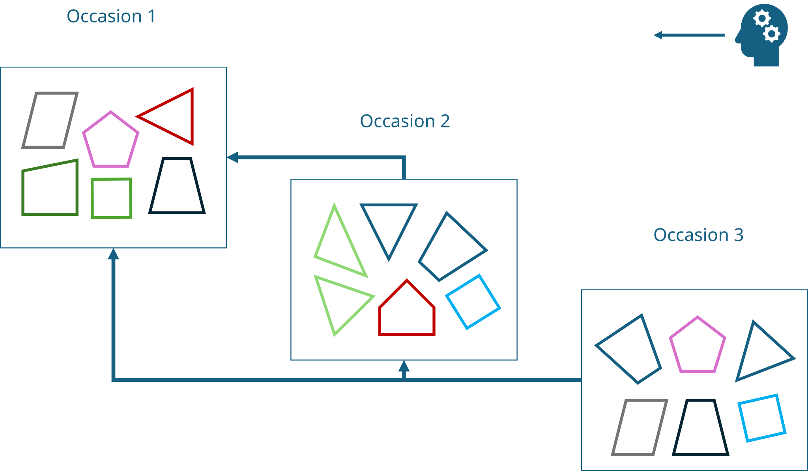
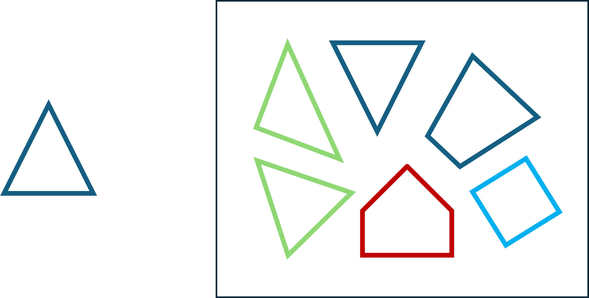
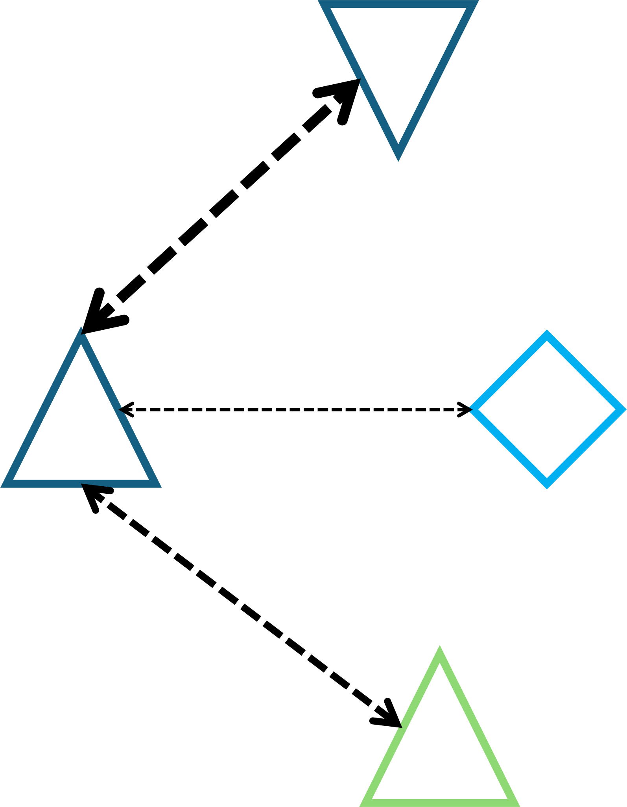
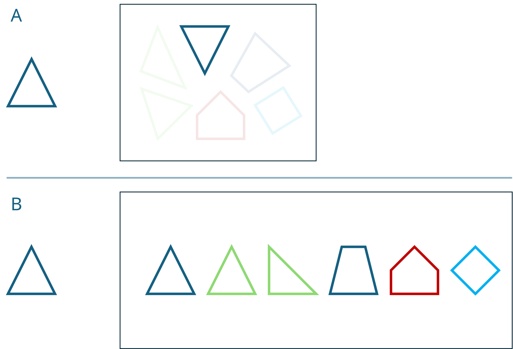

## Pattern-recognition simplified - a generic overview

The purpose of mark-recapture photo identification methods is to take a large photographic record of unknown individuals 
and, by using unique identifiers and markings, piece together which of those individuals were observed on multiple 
occasions. In the course of photography and in-person observations, one may wish to ascribe nicknames to these erstwhile
unknown individuals. Naming animals is fun and useful for keeping records in line! Over time, they may even become 
familiar to us, but the photographic record is naive to our experience.

We wish to clarify that photo mark-recapture methods match _patterns_, rather than _individuals_. An individual may have
been photographed on five separate occasions. Depending on the study system, that individual may have been given a different 
nickname on each of those occasions. On each occasion, perhaps that individual was photographed three times. This gives 
us 15 photographic examples, three from each of five occasions (with five different nicknames), all taken from a single 
individual.

The language around identifying individuals in a photographic record can get confusing very quickly if we lose track of 
the hierarchy of how we collect data. An individual _contains_ several within-occasion names, and dozens of photographic 
examples may be nested within each of these names. Their unique pattern, present in each photo, is the thread by which we
link all these photographic examples to assign an ultimate, true ID.

<br>

<p align="center">
  
  <figcaption align="center">Fig. 1: An individual exists in the photographic record as a collection of photos from several 
occasions, with multiple nicknames across all capture events.</figcaption>
</p>

<br>

<br>

Generally, we don't know in advance whether an individual was captured multiple times. Instead, we ask "have we seen this
individual/pattern elsewhere in our photographic record?" Different individual-recognition packages approach this question
in different ways, but their methods can be roughly similar. For simplicity, we illustrate the general idea with colourful
geometric shapes standing in for unique identifying patterns.

This may seem obvious, but it can be forgotten that photographic records are generally processed backwards; a pattern 
photographed on Occasion 2 (see Fig 2) can be compared to patterns photographed on Occasion 1, and patterns from Occasion
3 can be compared against both previous Occasions only. As we sample over more occasions and the photographic record grows,
later photos are compared against an ever-increasing pool of potential matches.

<br>

<p align="center">
  
  <figcaption align="center">Fig. 2: Photographic records are generally assessed looking backwards in time. Individuals/patterns 
captured later are compared against earlier occasions. Colourful polygons represent unique identifying patterns captured 
in each occasion.</figcaption>
</p>

<br>

<br>

To start finding matches in an existing photographic record, one can take one or more photographic examples of an individual 
on a given occasion and compare those against all previous photos in our photographic record. Here, we take our blue 
triangle from Occasion 3 and compare against our photographic record of colourful polygons captured on Occasion 2.

<br>

<p align="center">
  
  <figcaption align="center">Fig. 3: A focal individual/pattern (left) might be compared against a photographic record 
full of distinct patterns (right).</figcaption>
</p>

<br>

<br>

Some (at this point, imaginary)  algorithm compares our focal pattern against all other patterns in the photographic 
record and determines how well they match. Using our example (Fig. 4), we can imagine that our chosen algorithm compares
patterns by colour, number of vertices, and the angle of those vertices. On shape alone, our two triangles in the 
photographic record match very closely to the focal pattern, but only one is the right colour!

<br>

<p align="center">
  
  <figcaption align="center">Fig. 4: An example of pairwise comparisons between the focal pattern/individual and potential 
matching patterns/individuals in the photographic record. Thicker lines denote a better match.</figcaption>
</p>

<br>

<br>

Depending on the sophistication or bravery of the software used, the system will then either automatically assign positive
matches for the focal pattern in the photographic record (Fig. 5A) or sort the possible matches and present the best N 
matches for the user’s consideration (Fig. 5B). 

<br>

<p align="center">
  
  <figcaption align="center">Fig. 5: Two outcomes of individual recognition systems - A) the system determines positive 
matches or the absence of a suitable match automatically; B) the system sorts potential matches for the user to confirm 
or reject.</figcaption>
</p>

<br>

<br>

Sorting patterns based on similarity is relatively straight-forward. However, automatic matching requires some fine-tuning
of thresholds to determine a definitively “correct” pattern from a very similar but “incorrect” pattern . The green 
triangles above are very similar to our focal pattern. In this case, a suitable algorithm would need to reject a 
perfectly-matching silhouette that happens to have the wrong line colour. As patterns get more complex and/or the quality
of patterns declines (blurry photos, images at oblique angles, variation in zoom, loss of colour fidelity due to ambient 
lighting), it becomes harder to get this right.

Our approach (PlanarID) favours the sorting method (B): to leave final decision-making on matching patterns to the user.

<br>


## Example data collection

At some hypothetical field site, we may plan to catch and photograph as many individuals as possible once a week for a 
period of three months. We are working with a species with distinct markings that humans can't easily tell apart, but 
computer vision algorithms can. We have 12 distinct sampling sessions, and 11 sessions in which recaptures are possible.
Obviously, all individuals caught in the very first week must be novel individuals!

In the first week, let’s imagine we caught 5 individuals - 3 males and 2 females. We need to name these individuals 
something to keep our records straight for that week. For the first male, we might call him "1M"; the second male "2M";
the first female "1F". Or, we could simply name these individuals "1":"5"  or "A":"E", ignoring sex entirely in the naming
scheme. To maintain consistency in naming for the following 11 weeks, we need to choose a naming convention that reflects
_when_ an individual is caught, even though we don't yet know their true identity. To this end, we add a prefix  of date/time
of capture - for example ```Week1_2M``` , or ```[Month-Day]_2M``` .

As we capture and photograph individuals, we can note their within-week name, and perhaps record size, sex, and other 
useful data about that individual in a `.csv` . A suitable template `.csv` is generated on project directory creation in `/data`.
We might photograph one individual several times in a session, to make sure the individual is in focus and absent any glare
or visual artefacts that may obscure the identifying pattern. For an individual with two examples (i.e., photos) in the 
same session the naming convention for photos here then might be ```[Month-Day]_2M_1``` and ```[Month-Day]_2M_2```. The format 
```[Date]_[Within-week name]_[Example]``` makes it easy to distinguish between multiple photos of the same individual while 
still connecting our collected data to the photographic record.

When it comes time to colour-correct and name these photos, we can take these series  of photos – a label containing the
within-week name and date, followed by images of the corresponding individual - and apply tags or other image meta-data 
to each image. This can be done easily using `darktable` and other image processing programs, which can automatically use 
tags to name exported photos and append ```[Example]``` to filenames to prevent file naming conflicts.

The following week when we sample again, let’s say we caught only two individuals - a male and a female. We can't recognise
them by eye, so they need generic names. We can choose to call them "1M" and "1F", simply "1" and "2", or by naming them as
"6" and "7", being the 6th and 7th capture events. I favour the "1M" "2F" approach, as it reduces the complexity of data 
collection in the field/ at the moment of photography. Regardless of choice, adding their date of capture as a suffix makes
a new, unique name (e.g., ```Week2_1M``` or ```[Month-Day]_1M```). 

We can continue capturing, naming, photographing, and recording data from individuals caught every week. When it comes 
time to identify individuals that have been recaptured across sampling sessions, we can use our standardised photos, 
collected data from our `.csv`, and consistent naming convention in the shiny app and pipeline. We may choose to start by
comparing the individuals caught in week two with the individuals caught in week one to see if either the male or female
that week had previously been encountered. We may instead choose to process the entire photographic record in one go - 
comparing week two against week one, and week three against weeks one and two, and so on. In practice, we are trying to
find whether ```Week3_4M``` is the same individual as ```Week1_1M``` by comparing the patterns we imaged and 
_fingerprints_ we extracted. 

Matches are confirmed or rejected in the GUI. A list of within-week aliases that an individual was assigned is the output.


<br>

