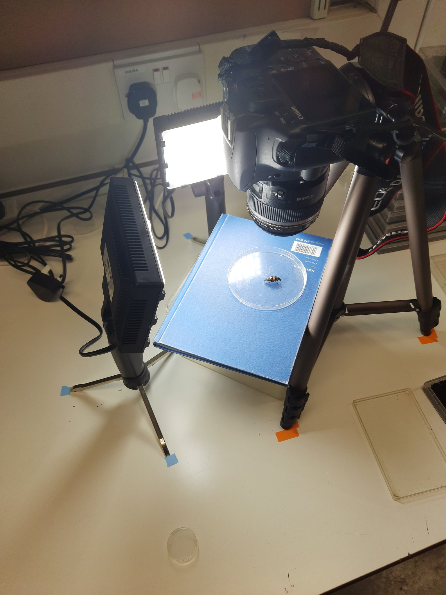

# Taking high-quality images and curating a photographic record

Photographs should be taken using consistent angles and distances from a single subject under similar lighting conditions.
We had great success with a static imaging platform: a flat surface at fixed elevation, distance, and angle to a 
tripod-mounted Canon 500D flanked by two 5500 Kelvin LED panels (Fig. 1). We used consistent shutter speed, ISO, and F-stop
for all photography sessions. Photographs of colour calibration cards under these same angles and distances should be 
captured periodically within each photography session.

<br>

<p align="center" >
  
  <figcaption align="center">Fig. 1: Our static imaging platform using a Canon 500D and 2 LED panels for controlled
lighting.</figcaption>
</p>

<br>

<br>

***For the photography step, we recommend photographing first a label/piece of paper with the individuals' within-week ID,
followed by a series of photos of that individual. Continue this process for each individual in turn – photograph a label,
then photograph the corresponding individual. This  order of photography minimises errors and simplifies data collection!***

Before adding photos to a project directory (in the unprocessed_photos subfolder), images should first be informatively 
named.  We want some way to group many examples (i.e., many photos) of an individual by some within-week name. Currently,
a naming format of ```[Date]_[within-week name]_[example and additional information]``` is necessary. This facilitates intuitive
grouping of photos in the photographic record by some within-week name and also connecting photos with corresponding data 
that we may have in a .csv.

Where possible, the white balance of images should be standardised against a grey card or fully colour-corrected against a 
colour-checker card. Both naming and colour correcting can be accomplished using an image-processing program (e.g., `darktable`).


<br>