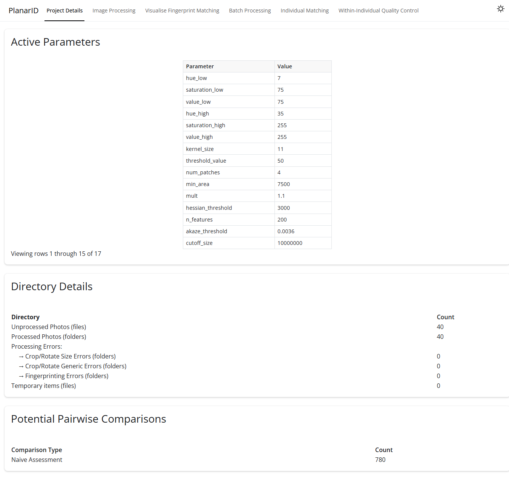
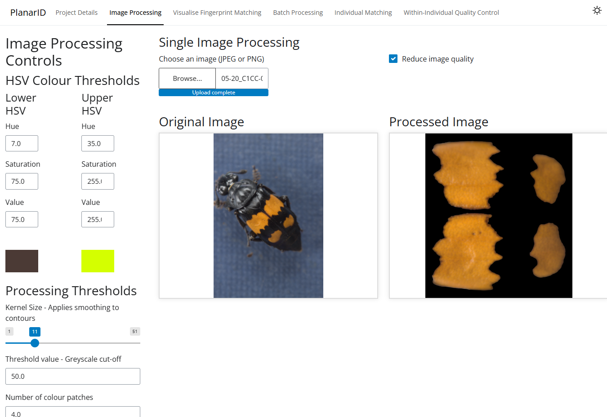
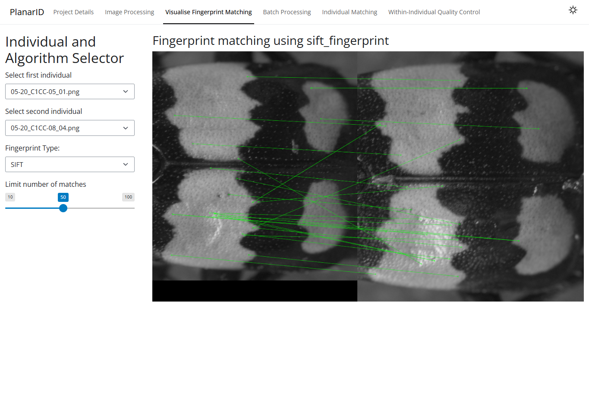
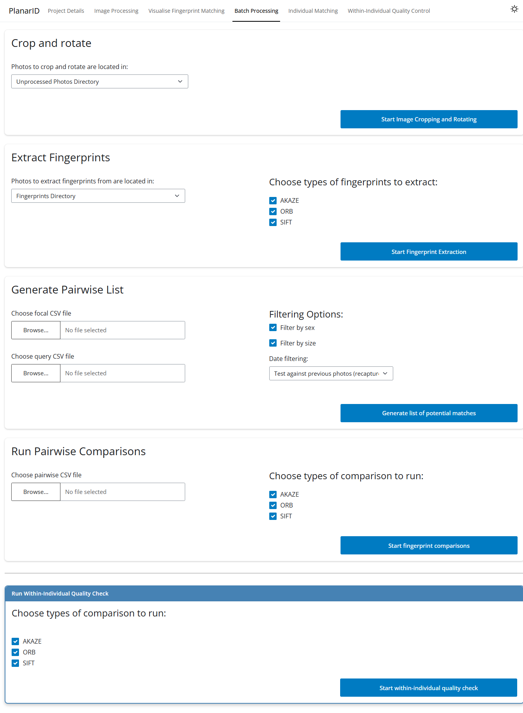
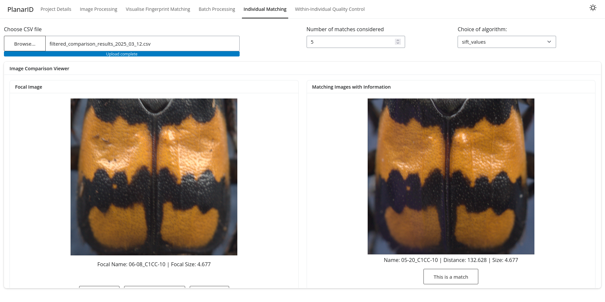
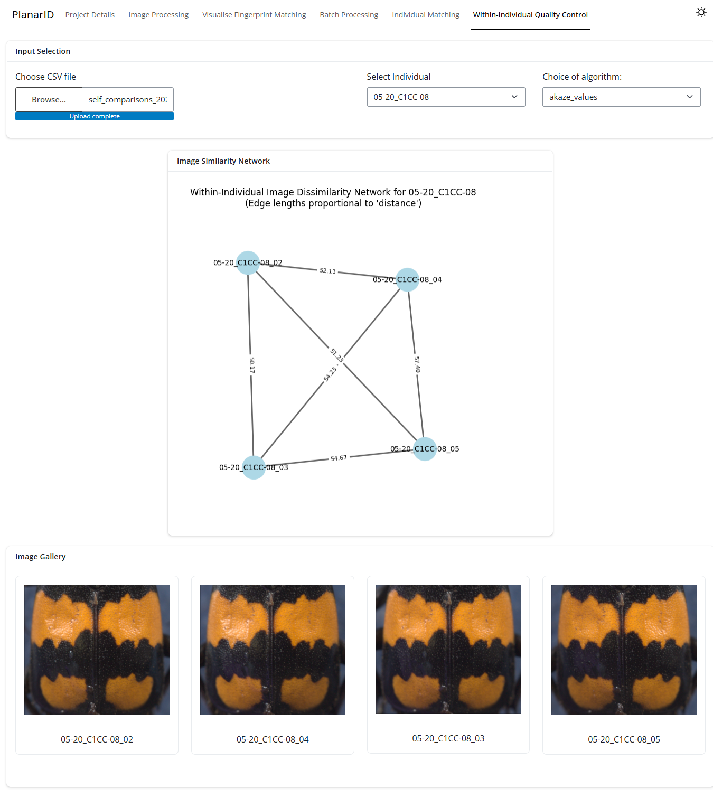
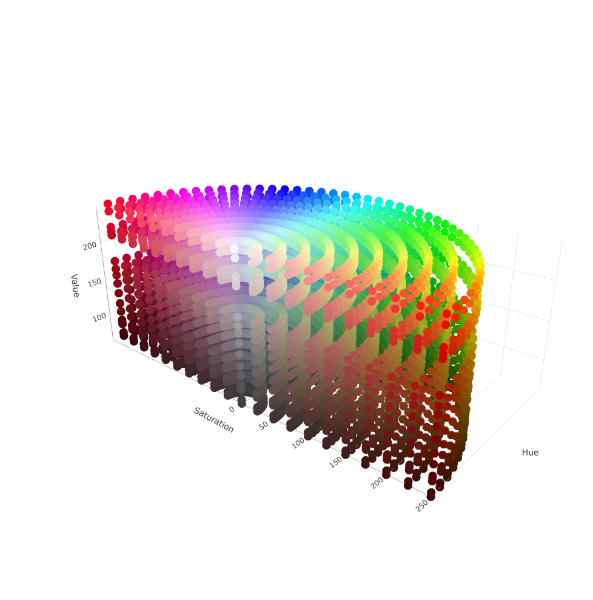
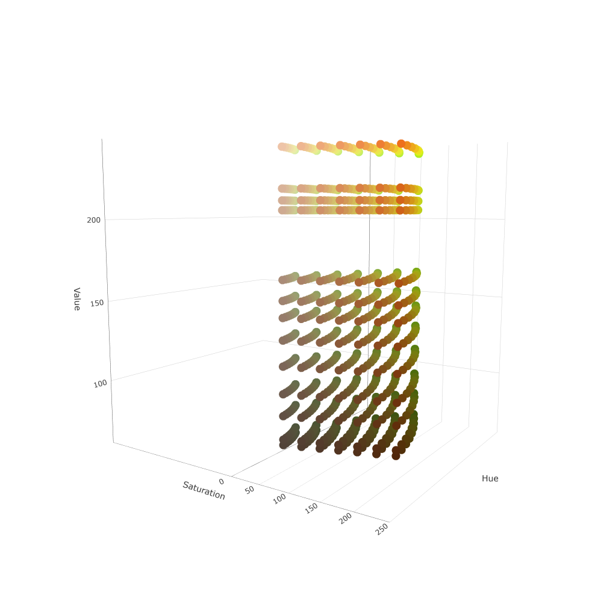

# PlanarID

Many animals have characteristic colour patterns and markings that vary amongst individuals. PlanarID is a browser-based 
shiny app and collection of python pipeline scripts that facilitate individual recognition from photographs, leveraging 
unique, discrete colour markings on small, hard-bodied insects and other invertebrates.

This system is intended to work with animals that can be handled and photographed in a consistent manner. This pipeline 
uses colour-based thresholding techniques to split images into regions of pattern and not pattern before calculating some
meaningful _fingerprint_ for an individual. As such, animals with discrete colour patterns (e.g., bold stripes, obvious 
wing veining, or ink-blot style blobs) are its intended focus. Animals with diffuse patterns where colours or pattern 
regions fade into each other rather than having hard borders may still be analysed with this set-up, but performance may
be poor.

<br>

## Getting started with PlanarID
I recommend installing an IDE (Pycharm Community Edition, Spyder, etc.) and cloning this repository. 

<table>
  <tr>
    <td align="left">
      <a href="https://www.jetbrains.com/pycharm/download/?section=windows" target="_blank">
        
      </a>
    </td>
    <td align="left">
      <a href="https://www.spyder-ide.org/" target="_blank">
        
      </a>
    </td>
  </tr>
</table>

These scripts have been tested using Python 3.9 and Python 3.12, on both Ubuntu 22.04 and Windows 11. 
However, development was mainly conducted on a Linux machine; for best performance, Linux is preferred!  

<br>

### Installing packages and project setup

Once cloned, limited use should be immediately available by running the following commands in the console of your chosen IDE:

```bash
pip install -r requirements.txt
project_folder_setup.py
```

This will install the necessary Python libraries, and, by default, create a working folder called "Tutorial" in the 
`/Documents` directory (structure outlined below.

<br>

### Launching the app
The browser-based shiny UI is launched from the terminal with the following:

```bash
shiny run planar-id.py
```

By default, this will connect with the existing "Tutorial" project directory. On linux, the app dashboard should launch 
automatically; on Windows, the user may need to navigate to the app in a web browser.

On both systems, the following code will be printed in the terminal - click on the `http` link, or copy it into your web 
browser to view and interact with the app:

```bash
INFO:     Started server process [XXXXX]
INFO:     Waiting for application startup.
INFO:     Application startup complete.
INFO:     Uvicorn running on http://127.0.0.1:8000 (Press CTRL+C to quit)
```

By default, the code snippets above will produce a new project folder (outline below) in `/Documents` called "Tutorial", 
and launch the shiny GUI that connects with default user parameters and visualisation/processing tools. For more guidance, 
example photos and corresponding tutorial are available in the `tutorial` folder of this repo.

<br>

### General details
To customise project names, one need only change the project name defined at the start of the `project_folder_setup.py`
and `planar-id.py` scripts to the desired name. This facilitates moving between several projects with minimal conflict.

<br>

General folder structure of active projects - produced by `project_folder_setup.py`:

```
[Project name]
|
|───unprocessed_photos
|
|───fingerprints
|
|───data  
|       user_parameters.csv
|       focal_df_template.csv
|
|───processing_errors
|       |───crop_rotate_size
|       |───crop_rotate_generic
|       └───fingerprinting
| 
|───logs
|       processing_error_logs.txt
|       fingerprinting_error_logs.txt
|       matching_error_logs.txt
|       processing_times.txt
|  
|───temp
|  
└───scripts
```

Initial (preferrably colour-corrected) images should be deposited in the `unprocessed_photos` folder. Many app functions
rely on calling images and files from known locations - each function by default calls from and desposits into the relevant
locations without user intervention.

<br>

### GUI Overview
The browser-based GUI should open to a home page with details about the current contents of the project directory and 
various subfolders (Fig. 1). There is also a table of user-editable values for all stages of processing.

<br>

<p align="center" >
  
  <figcaption align="center">Fig. 1: An example of the PlanarID homepage, outlining all user-definable parameters, details
about the photographic record and processing status, and ancillary information.</figcaption>
</p>

<br>

<br>

The user can navigate the different pages of the UI by clicking on the desired page in the top navbar. 
The **Image Processing** page (Fig. 2) and **Visualise Fingerprint Matching** page (Fig. 3) are interactive testing tools 
for the user to set and change all possible processing values on chosen images and pairs of images. The **Image Processing** 
page can access images anywhere on the machine, but **Visualise Fingerprint Matching** can only access images in the 
`unprocessed_photos` folder.

<br>

<p align="center">
  
  <figcaption align="center">Fig. 2: An interactive tool for changing image-processing settings. The original image (left)
is reduced in complexity to a discretized pattern (right). The consequences of these decisions on image segmentation and
"fingerprint" extraction are live-rendered</figcaption>
</p>

<br>

<p align="center">
  
  <figcaption align="center">Fig. 3: This tool allows the user to choose any pair of unprocessed images in the unprocessed_photos
folder, and visualise the quality of image segmentation and image comparison that emerges from settings defined in the previous
section.</figcaption>
</p>

<br>

<br>


The **Batch Processing** page is where the main functions of the pipeline can be called - segmenting images, extracting
fingerprints en-masse, generating a list of which images should be compared with each other, and running those pairwise
comparisons (Fig. 4). There is also a convenience tool that runs within-individual comparisons using selected fingerprints to help
spot mis-labelled, blurred, or otherwise problematic images.

<br>

<p align="center">
  
  <figcaption align="center">Fig. 4: The work-centre of the PlanarID app: all stages of image processing and comparison
are launched from this window. Settings defined in the interactive tools (above) are applied to hundreds, thousands, or tens 
of thousands of images and extracted patterns.</figcaption>
</p>

<br>

<br>

The **Individual Matching** page takes the output of pairwise comparisons (a `.csv` file) and shows these results to the 
user, with buttons for navigating, choosing which _fingerprinting_ algorithm to sort by,and confirming matches in the 
photographic record.

<br>

<p align="center">
  
  <figcaption align="center">Fig. 5: The final step of identifying individuals that were recaptured. The user selects
a csv outputted from "Run Pairwise Comparisons" and manually compares a chosen number of best-matching options for each
focal individual according to 1 of 4 algorithms at a time. The presence or absence of a matching image is confirmed and 
written to a results .csv. </figcaption>
</p>

<br>

<br>

The **Generate and Visualise Encounter History** page is a convenience tool for converting the output of confirmed matches
(`matches_YYYY_MM_DD.csv`) into a census-style encounter history. This tool renders tables of encounter frequencies per
individual identified in the photographic record, and a population-level distribution of encounter frequencies (Figure 6). 
Saving the census-style history makes the output of PlanarID more readily usable by mark-recapture packages in R, but is 
not strictly necessary! 

The network graph can be used as a diagnostic tool for the matching output (or just looks nice!). Chains of matched images
should be clear and disconnected from other chains. If there are erroneous matches, these may be apparent as two distinct
chains of images connected by a single node - this should prompt some investigation into that collection of images.


<p align="center">
  
  <figcaption align="center">Fig. 6: A convenience tool for summarising and saving the capture record in an accessible format.
The user selects a "matches" csv outputted from the "Individual matching" process. </figcaption>
</p>

<br>

<br>

The **Within-Individual Quality Control** page takes the output of within-individual comparisons (a `.csv` file) and shows
network graphs of apparent within-individual dissimilarity and a gallery of all images of the chosen individual (Fig. 7).

<br>

<p align="center">
  
  <figcaption align="center">Fig. 7: A network graph of within-individual photographic example similarity and a gallery 
of relevant images for quality-control. In the graph, correctly named images (ascribed to the right individual) should form
a cluster, and obvious outliers will be removed from that cluster.</figcaption>
</p>

<br>

<br>


<br>

### Core app processes and values

There are many settings of colour thresholds, image blurring, and _fingerprint_ sensitivity to obvious or subtle marks. 
Some key details of these parameters, their consequences, and use are outlined below.

<br>

#### Splitting images into _pattern_ and _not pattern_
This involves taking high quality and/or colour-corrected images and using colour thresholding (Figure 2;8) to extract regions of the
_pattern_. The process can be visualised in the shiny UI and all possible values played with. When suitable values have 
been chosen, this process can be applied at scale. This step results in a cropped version of the original image and a 
_mask_ (a twin image containing only the pattern, with other details blacked out).

| Parameter       | Meaning/Consequence                                                                                                              |                                                          Possible Values |
|:----------------|:---------------------------------------------------------------------------------------------------------------------------------|-------------------------------------------------------------------------:|
| hue_low         | The lower bound of colour (i.e., red, burnt-orange, yellow or blue, etc.) on which images are segmented                          |                                                Integer between 0 and 179 |
| saturation_low  | The lower bound of colour vibrance or intensity (i.e., grey, pastel, or intense colour) on which images are segmented            |                                                Integer between 0 and 255 | 
| value_low       | The lower bound of brightness (i.e., from very dark/black through to white) on which images are segmented                        |                                                Integer between 0 and 255 |
| hue_high        | The upper bound of colour (i.e., red, burnt-orange, yellow or blue, etc.) on which images are segmented                          |                                                Integer between 0 and 179 |
| saturation_high | The upper bound of colour vibrance or intensity (i.e., grey, pastel, or intense colour) on which images are segmented            |                                                Integer between 0 and 255 | 
| value_high      | The upper bound of brightness (i.e., from very dark/black through to white) on which images are segmented                        |                                                Integer between 0 and 255 |
| kernel_size     | The amount of smoothing applied to the border of _pattern_ and _not pattern_ areas of images                                     |                                      Odd integer >= 1 (e.g., 1,3,5,7...) |
| threshold_value | A grey-scale threshold for accepting/rejecting regions of images as parts of the identifying _pattern_                           |                                                Integer between 0 and 255 |
| num_patches     | The number of identifying marks/ colour-patches expected from a single individual                                                |       Depending on the idiosyncracies of the study species; Integer >= 1 |
| min_area        | The minimum expected area (in pixels) of each identifying mark/ colour-patch. Used to filter out dirt, noise or visual artefacts |  Depending on the magnification and resolution of images; Integer >= 100 |
| mult            | A scalar indicating how much area around the identifying pattern should be included in processed masks and images                |                                                               Float >= 1 |
| cutoff_size     | The total size (in pixels) a correctly-processed image should be, after colour-based segmentation and cropping                   | Depending on the magnification and resolution of images; Integer >= 100  |

<br>

<table>
  <tr>
    <td align="center"><br><sub>H[0:179] S[0:255] V[0:255]</sub></td>
    <td align="center"><br><sub> H[11:40] S[75:240] V[80:240]</sub></td>
  </tr>
</table>
<p align="center"><em>Figure 8: The full HSV colour space and an example of filtering the HSV space to a range of values, 
as in our colour-thresholding.</em></p>


<br>

#### Extracting _fingerprints_ from processed images
This involves processing _masks_ of each individuals' _pattern_ and calculating keypoints and descriptors that describe 
large areas of _pattern_, turning points, colour gradients, and corners.
These _fingerprints_ are saved as `.txt` files for later use.
Four algorithms (available for non-commercial use) are available - AKAZE, ORB, SIFT, and SURF (see more below).

| Parameter          | Meaning/Consequence                                                                                           |               Possible Values |
|:-------------------|:--------------------------------------------------------------------------------------------------------------|------------------------------:|
| hessian_threshold  | A value used by the SURF algorithm to filter out non-meaningful keypoints. Larger values are more selective.  |              Integer >= 100   |
| akaze_threshold    | A value used by the AKAZE algorithm to filter out non-meaningful keypoints. Larger values are more selective. | Float between 0.0001 and 0.01 |
| n_features         | The maximum number of keypoints to be extracted from _patterns_ by SIFT and ORB                               |                Integer >= 100 |

<br>

#### Generating list of pairwise comparisons to run
This stage involves providing a `.csv` of focal individuals (i.e., individuals in the photographic record you want to 
identify) and a `.csv` of a test individuals (i.e., the bank of photographed individuals you want to compare against).
These `.csv` files can be identical, partially overlapping, or non-overlapping, depending on when data were collected 
and which individuals you wish to focus on. A template of appropriate format is generated when the project folder is created.
This function compares the focal and test set of individuals by (optionally) size, sex, and date to identify which individuals
could reasonably be compared based solely on this metadata. Date and sex filters are chosen interactively in the UI, 
while accepted error in body size is a saved parameter (below).

| Parameter    | Meaning/Consequence                                                                                                |                                                     Possible Values |
|:-------------|:-------------------------------------------------------------------------------------------------------------------|--------------------------------------------------------------------:|
| size_offset  | The amount of error +/- an individuals' body size that will be accepted as an appropriate candidate for comparison |  Depending on the chosen body size/weight measure chosen; Float > 0 |

<br>

#### Conducting pairwise comparisons

This stage takes the output of the previous step (a `.csv` file) and conducts the appropriate comparisons. A _distance_ value 
is generated for each pairwise comparison according to one or more of four _fingerprint_ algorithms. A large _distance_ means 
two images/patterns are very dissimilar and thus unlikely to contain the same individual, while small _distances_ indicate 
two images/fingerprints are very similar and thus potentially are images of the same individual at two points in time. 
This produces two `.csv` files - the complete output of all pairwise comparisons and their _distance_ values (potentially 
millions of rows long), and a filtered subset that contains the N best matches for each focal individual according to all
chosen algorithms (a smaller, more manageable file). This second, filtered file is used in the ***Individual Matching*** page.


| Parameter                     | Meaning/Consequence                                                                                                                         |          Possible Values |
|:------------------------------|:--------------------------------------------------------------------------------------------------------------------------------------------|-------------------------:|
| number_comparisons_considered | The number of _N_ best matches for each focal individual according to all chosen algorithms that the pairwise results should be filtered to | Integer between 1 and 40 |

<br>

## Example image segmentation and fingerprinting

Different systems and patterns require different parameter values to segment for fingerprinting. Below, I include some 
example parameter values for different kinds of backgrounds/patterns that we may want to process.

A butterfly with black and green wings wings, against a light, beige background of sand. Image sourced from 
[here](https://www.pickpik.com/green-malachite-butterfly-green-niagara-butterfly-conservatory-exotic-insect-wildlife-black-67926).
Setting colour thresholds to separate green patches from a beige background might be difficult. Instead, we can focus on
the black parts of the body and wings to segment the entire butterfly from the background (Fig. 9).. We capture dark regions
by setting `value` between 0 and 150. `threshold_value` is a separate parameter that also needs to be lowered to accept 
segmenting on dark areas. Here, the wings and body form one contiguous region of dark pattern, so we can set `num_patches` 
to one. When it comes to generating *fingerprints*, we will only be describing features along the wings and body, removing 
any background noise.

<div style="display: flex; align-items: center; justify-content: center; gap: 20px;">

  <!-- Table -->
  <div style="flex: 1; max-width: 200px; display: flex; justify-content: center;">
    <table>
      <tr><th>Parameter</th><th>Value</th></tr>
      <tr><td>hue_low</td><td>0</td></tr>
      <tr><td>saturation_low</td><td>0</td></tr>
      <tr><td>value_low</td><td>0</td></tr>
      <tr><td>hue_high</td><td>179</td></tr>
      <tr><td>saturation_high</td><td>255</td></tr>
      <tr><td>value_high</td><td>150</td></tr>
      <tr><td>kernel_size</td><td>7</td></tr>
      <tr><td><strong>threshold_value</strong></td><td><strong>0</strong></td></tr>
      <tr><td>num_patches</td><td>1</td></tr>
    </table>
  </div>

  <!-- Images with labels -->
  <div style="flex: 1; display: flex; flex-direction: column; align-items: center;">
    
    <span style="margin-top: 5px; font-weight: bold;">Original Image</span>
  </div>

  <div style="flex: 1; display: flex; flex-direction: column; align-items: center;">
    
    <span style="margin-top: 5px; font-weight: bold;">Segmented image/pattern</span>
  </div>

  <div style="flex: 1; display: flex; flex-direction: column; align-items: center;">
    
    <span style="margin-top: 5px; font-weight: bold;">Feature Points restricted to wing pattern</span>
  </div>

</div>
<p align="center"><em>Figure 9: The key parameter values and stages of fingerprinting wing patches in a butterfly with dark wings 
and light patches that are similar to background colours.</em></p>

<br>

A butterfly with white and red markings on black wings, against a neutral woody-brown background. Image sourced from
[here](https://en.wikipedia.org/wiki/Vanessa_atalanta#/media/File:Red_admiral_(Vanessa_atalanta)_Hungary.jpg).
Extracting a bold colour like red is relatively straightforward using HSV values (listed below; Fig. 10). There are 4 distinct
regions of red patches, anterior-posterior along each wing, and laterally across the back of each wing, so we set `num_patches`
to four. We might expect good performance of fingerprinting the red regions to discriminate between individuals.

Our major issue here is that we must focus on one focal colour - choosing red means we ignore white patches that might be
of value for identification. White regions can be extracted separately, but this may be difficult against a light background. 
Further, some light patches are diffuse, and other are tinged blue, making precise colour thresholding labour intensive.

<div style="display: flex; align-items: center; justify-content: center; gap: 20px;">

  <!-- Table -->
  <div style="flex: 1; max-width: 200px; display: flex; justify-content: center;">
    <table>
      <tr><th>Parameter</th><th>Value</th></tr>
      <tr><td>hue_low</td><td>0</td></tr>
      <tr><td>saturation_low</td><td>0</td></tr>
      <tr><td>value_low</td><td>90</td></tr>
      <tr><td>hue_high</td><td>10</td></tr>
      <tr><td>saturation_high</td><td>255</td></tr>
      <tr><td>value_high</td><td>240</td></tr>
      <tr><td>kernel_size</td><td>7</td></tr>
      <tr><td>threshold_value</td><td>10</td></tr>
      <tr><td>num_patches</td><td>4</td></tr>
    </table>
  </div>

  <!-- Images with labels -->
  <div style="flex: 1; display: flex; flex-direction: column; align-items: center;">
    
    <span style="margin-top: 5px; font-weight: bold;">Original Image</span>
  </div>

  <div style="flex: 1; display: flex; flex-direction: column; align-items: center;">
    
    <span style="margin-top: 5px; font-weight: bold;">Segmented red pattern</span>
  </div>

  <div style="flex: 1; display: flex; flex-direction: column; align-items: center;">
    
    <span style="margin-top: 5px; font-weight: bold;">Feature Points restricted to red patches</span>
  </div>

</div>
<p align="center"><em>Figure 10: The key parameter values and stages of fingerprinting wing patterns in a butterfly with 
bold red patches against distinct background colours.</em></p>

<br>

A burying beetle with discrete orange colour patches on a black body, against a blue background. Image sourced from our
testing population. Segmenting orange patterns from blue and black is almost trivial (Parameters outlined in Fig. 11).
`threshold_value` is returned to the default greyscale value of 50. We expect 4 discrete patches in this species, so
`num_patches` is set to four. `kernel_size` is left at default, but higher values will smooth out jagged edges of extract
colour patches.

<div style="display: flex; align-items: center; justify-content: center; gap: 20px;">

  <!-- Table -->
  <div style="flex: 1; max-width: 200px; display: flex; justify-content: center;">
    <table>
      <tr><th>Parameter</th><th>Value</th></tr>
      <tr><td>hue_low</td><td>0</td></tr>
      <tr><td>saturation_low</td><td>75</td></tr>
      <tr><td>value_low</td><td>85</td></tr>
      <tr><td>hue_high</td><td>25</td></tr>
      <tr><td>saturation_high</td><td>240</td></tr>
      <tr><td>value_high</td><td>240</td></tr>
      <tr><td>kernel_size</td><td>7</td></tr>
      <tr><td>threshold_value</td><td>50</td></tr>
      <tr><td>num_patches</td><td>4</td></tr>
    </table>
  </div>

  <!-- Images with labels -->
  <div style="flex: 1; display: flex; flex-direction: column; align-items: center;">
    
    <span style="margin-top: 5px; font-weight: bold;">Original Image</span>
  </div>

  <div style="flex: 1; display: flex; flex-direction: column; align-items: center;">
    
    <span style="margin-top: 5px; font-weight: bold;">Annotated orange pattern</span>
  </div>

  <div style="flex: 1; display: flex; flex-direction: column; align-items: center;">
    
    <span style="margin-top: 5px; font-weight: bold;">Feature Points restricted to orange patches</span>
  </div>

</div>
<p align="center"><em>Figure 11: The key parameter values and stages of fingerprinting elytral patterns in a burying beetle
- bold orange patches against distinct body and background colours.</em></p>

<br>

## Availability of computer vision algorithms
AKAZE, ORB, and SIFT are freely-available computer-vision algorithms bundled with `opencv` in Python.
SURF, however, is under a [non-commercial licence](https://people.ee.ethz.ch/~surf/download.html) and not bundled with the default `opencv` library.
To enable SURF, `opencv` needs to be compiled with "non-free" algorithms enabled. 
We have had mixed success with this on Windows but [this page](https://www.samontab.com/web/2023/02/installing-opencv-4-7-0-in-ubuntu-22-04-lts/) outlines how to achieve this on Linux.

AKAZE, ORB, and SIFT are very effective at generating _fingerprints_ for comparison, so little is lost if SURF is not 
available to you. Further, the shiny GUI and pipeline will only present algorithms that are available to you, so an 
absence of SURF will not lead to errors or poor performance.

<br>

## Upgrade path

The current version of PlanarID is an effective tool for identifying individuals on the basis of unique, binary, colour-based
patterns. Future focuses for development are quality of life improvements for the UI, and methodological improvements for
the pipeline.

Core functions:
- Expand image processing to extract and process multiple colour ranges simultaneously.
- Add additional fingerprinting algorithms/ alternative fingerprint comparison methods.
- Add user control over settings for parallel processes (for RAM-limited computers).

<br>

Quality of life:
- Tooltips for all features requiring user interaction or decision-making.
- Enable user control over multiple or single matches allowed in `Individual Matching` page.
- More flexible within-individual quality control method to handle matched images from the end-stage of the pipeline.
- Better handling of `.csv`, output files, and parameter settings.
- Automate batch-processing steps (bundle `Crop and rotate`, `Extract fingerprints`, `Generate pairwise list`, and 
`Pairwise comparisons` together).
- Format and distribute PlanarID as a python package.