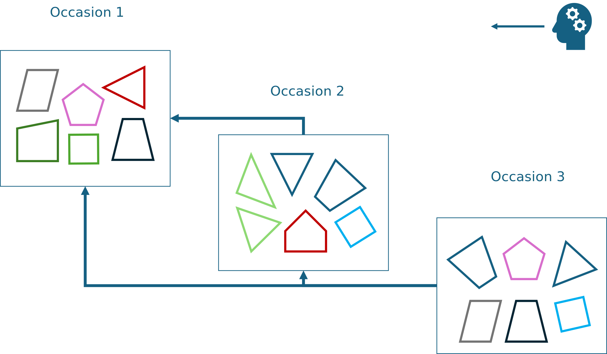
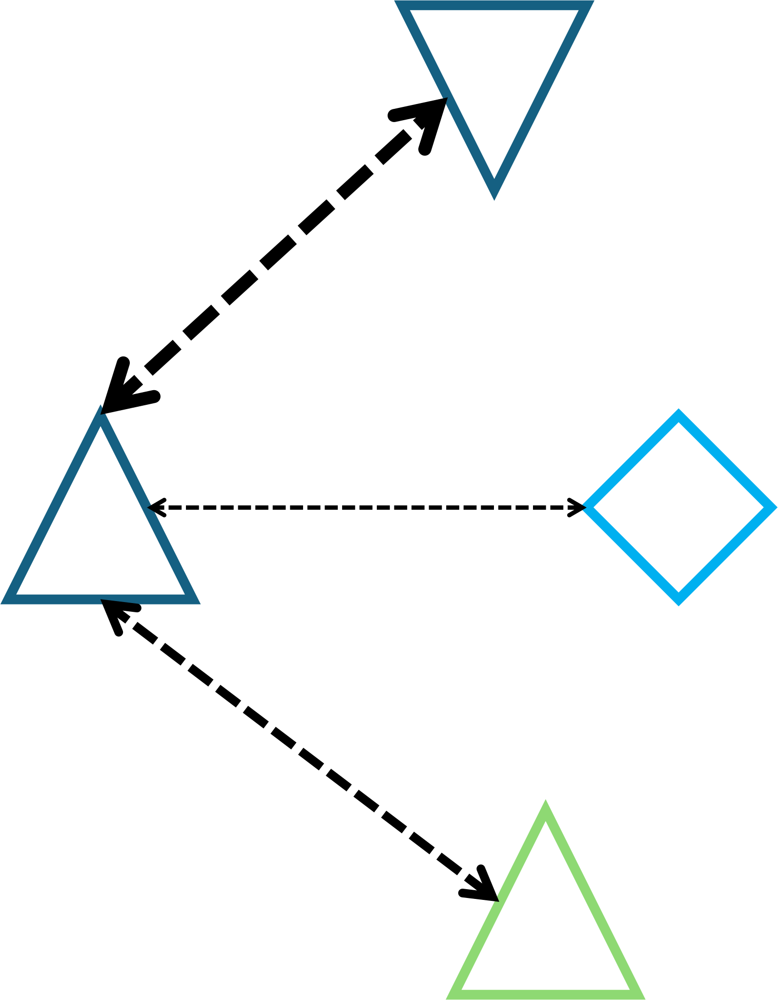

# PlanarID

Many animals have characteristic colour patterns and other markings that distinguish individuals from each other. 
PlanarID is a browser-based shiny app and collection of python pipeline scripts that facilitate individual recognition 
from photographs, leveraging unique, disrete colour markings on hard-bodied insects and other invertebrates.

This system is intended to work with small, hard-bodied animals that can be handled and photographed in a consistent manner.
This pipeline uses colour-based thresholding techniques to split images into regions of _pattern_ and _not pattern_ before 
calculating some meaningful _fingerprint_ for an individual. As such, animals (chiefly insects, but hard-bodied animals 
more generally) with discrete colour patterns - bold stripes, obvious wing veining, or ink-blot style blobs - are the 
intended focus of this pipeline. Animals with diffuse patterns - where colours or pattern regions fade into each other 
rather than having hard borders - may still be analysed with this set-up, but performance may be poor!

We outline the general principles at play in utilising a photographic record, a workflow for collecting and pre-processing 
images suitable for subsequent _fingerprinting_ and analysis. Additionally, we provide a generic narrative accounting of 
decisions made in curating and exploring a photographic record.

<br>

## Animal- / Pattern-recognition simplified

The purpose of mark-recapture photo identification methods is to take a large photographic record of unknown individuals 
and, using unique identifiers and markings, piece together which of those individuals were observed on multiple occasions.
In the course of our photography and in-person observations we may need to ascribe nicknames to these erstwhile unknown 
individuals. Naming animals is fun and useful for keeping records in line! Over time, they may even become familiar to us
but the photographic record is naive to our experience.

I mention this only to clarify that photo mark-recapture methods match _patterns_, rather than individuals. An individual 
may have been photographed on five separate occasions. Depending on the study system, that individual may have been given a 
different nickname on each of those occasions. Maybe, on each occasion, that individual was photographed three times. This
gives us 15 photographic examples, from 5 occasions, with 5 different nicknames, all of a single individual.

The language around identifying individuals in a photographic record can get confusing very quickly if we lose track of 
the hierarchy of how we collect data. An individual _contains_ several within-occasion names and dozens of photographic
examples may be nested within each of these. Their unique pattern, present in each photo, is the thread by which we link 
up all of these photographic examples to assign an ultimate, true ID. 

<br>

<p align="center">
  
  <figcaption align="center">Fig. 1: An individual exists in the photographic record as a collection of photos from several 
occasions, withmultiple nicknames across all capture events.</figcaption>
</p>

<br>

<br>

Generally, we don't know in advance whether an individual was captured multiple times. Instead we ask "have we seen this 
individual/pattern elsewhere in our photographic record?". Different individual-recognition packages approach this question
in different ways but, generally, their methods are roughly similar. For simplicity, we illustrate the general idea with 
colourful geometric shapes standing in for unique identifying patterns.

Something that may seem obvious, but can be overlooked is that photographic records are generally processed backwards; 
a pattern photographed on occasion two can be compared to patterns photographed on occasion one and patterns from occasion 
three can be compared against both occasions one and two. As we sample on more occasions, and the photographic record grows,
later photos are compared against an ever-increasing pool of potential matches.

<br>

<p align="center">
  
  <figcaption align="center">Fig. 2: Photographic records are generally assessed looking backwards in time. Individuals/patterns 
captured later are compared against earlier occasions. Colourful polygons represent unique identifying patterns captured in each occasion.</figcaption>
</p>

<br>

<br>

First, we can take a photographic example (or many photographic examples) of an individual on a given occasion and compare 
that (or those) against all previous photos in our photographic record. Here, we take our blue triangle from occasion 3, 
and compare against our photographic record of of colourful polygons captured on occasion two.

<br>

<p align="center">
  
  <figcaption align="center">Fig. 3: A focal individual/pattern (left) might be compared against a photographic record 
full of distinct patterns (right).</figcaption>
</p>

<br>

<br>

Some algorithm compares our focal pattern against all other patterns in the photographic record and determines how well 
they match. In this example (Fig. 4), we can imagine that our chosen algorithm compares patterns by colour, number of vertices,
and the angle of those vertices. On shape alone, our two triangles in the photographic record match very closely to the 
focal pattern, but only one is the right colour!

<br>

<p align="center">
  
  <figcaption align="center">Fig. 4: An example of pairwise comparisons between the focal pattern/individual and potential 
matching patterns/individuals in the photographic record. Thicker lines denote a better match.</figcaption>
</p>

<br>

<br>

Depending on the sophistication or bravery of the software used, the system will then either automatically assign positive
matches for the focal pattern in the photographic record (Fig. 5A), or sort the possible matches and present the best N matches for
the users consideration (Fig. 5B). 

<br>

<p align="center">
  
  <figcaption align="center">Fig. 5: Two outcomes of individual recognition systems - A) the system determines positive 
matches or the absence of a suitable match automatically; B) the system sorts potential matches for the user to confirm 
or reject.</figcaption>
</p>

<br>

<br>

Sorting patterns based on similarity is relatively straight-forward. However, automatic matching requires some 
fine-tuning of thresholds to determine a positive match from just a very similar pattern. The green triangles above are 
very similar to our focal pattern. So a suitable algorithm would need to reject a perfectly-matching silhouette that happens
to have the wrong line colour. As patterns get more complex, and the quality of patterns declines (blurry photos, images at oblique 
angles, variation in zoom, loss of colour fidelity due to ambient lighting) it becomes harder to get this right.

Our approach favours the sorting method, to leave final decision-making on matching patterns to the user.

<br>

## Taking high-quality images and curating a photographic record

Photographs should be taken from consistent angles and distances from a single subject under relatively similar lighting 
conditions. We had great success with a static imaging platform - a flat surface at fixed elevation, distance, and angle 
to a tripod-mounted Canon 500D, flanked by two 5500 Kelvin LED panels (Fig. 6). We used consistent shutter speed, ISO, and F-stop 
for all photography sessions. Photographs of colour calibration cards under these same angles and distances should be 
captured periodically within each photography session.

<br>

<p align="center" >
  
  <figcaption align="center">Fig. 6: Our static imaging platform using a Canon 500D and 2 LED panels for controlled
lighting.</figcaption>
</p>

<br>

<br>

***For the photography step, I recommend first photographing a label/piece of paper with the individuals' within-week ID, 
followed by a series of photos of that individual. Continue this process for each individual in turn - photo of their name 
followed by photos of them. This minimises errors and simplifies data collection in the moment and annotation later!.***

Before adding photos to a project directory (in the unprocessed_photos subfolder) for _fingerprinting_ images should first 
be informatively named. We want some way to group many examples (i.e., many photos) of an individual by some within-week name. 
Currently, a naming format of `[Date]_[within-week name]_[example and additional information]` is necessary.
This facilitates intuitive grouping of photos in the photographic record by some within-week name, and also connecting 
photos with corresponding data that we may have in a `.csv`.

Where possible, the white balance of images should be standardised against a grey card, or fully colour-corrected against
a colour-checker card. Both naming and colour correcting can be accomplished using a image-processing program (e.g., `darktable`).

<br>

### Example data collection
In a hypothetical field site we may plan to catch and photograph as many individuals as possible once a week for a period 
of three months. We are working with a species with distinct markings that humans can't easily tell apart, but computer 
vision algorithms can. We have 12 distinct sampling sessions, and 11 sessions in which recaptures are possible. Obviously
all individuals caught in the very first week have to be novel individuals!  

In the first week, lets imagine we caught 5 individuals - 3 males and 2 females.
We need to name these individuals something to keep our records straight for that week. For the first male, we might call
him "1M"; the second male "2M"; the first female "1F". Or, we could simply name these individuals "1":"5" or "A":"E". 
To maintain consistency in naming for the following 11 weeks, we need to choose a naming convention that reflects _when_ 
an individual is caught, even though we don't yet know their true identity. To this end, we add a suffix of date/time of 
capture - for example ```Week1_2M```, or ```[Month-Day]_2M```.

As we capture and photograph individuals, we can note their within-week name, and perhaps record size, sex, and other 
useful data about that individual in a `.csv`. A suitable template `.csv` is generated on project directory creation in `/data`.
We might photograph one individual several times in a session, to make sure the individual is in focus and absent any glare
or visual artefacts that may obscure the identifying pattern. For an individual with two examples (i.e., photos) in the 
same session the naming convention for photos here then might be ```[Month-Day]_2M_1``` and ```[Month-Day]_2M_2```. The 
format ```[Date]_[Within-week name]_[Example]``` makes it easy to distinguish between multiple photos of the same individual,
and still connect our collected data to the photographic record.

When it comes time to colour-correct and name these photos, we can take these obvious series of photos, separated by labels, 
and apply tags or other image meta-data to each image. This can easily be done using `darktable` and other image processing
programs, which can automatically append ```[Example]``` to file names to prevent file naming conflicts.

The following week, when we sample again, lets say we caught only two individuals - a male and a female. We can't recognise 
them by eye, so they need generic names. We can choose to call them "1M" and "1F", simply "1" and "2", or by naming them 
as "6" and "7", being the 6th and 7th capture events. I favour the "1M" "2F" approach, as it reduces the complexity of 
data collection in the field/ at the moment of photography. Regardless of choice, adding their date of capture as a suffix
makes a new, unique name (e.g., ```Week2_1M``` or ```[Month-Day]_1M```).

We can continue capturing, naming, photographing, and recording data about individuals caught every week. 
When it comes time to identify individuals that have been recaptured across sampling sessions, we can use our standardised 
photos, collected data from our `.csv`, and consistent naming convention in the shiny app and pipeline. We may choose to 
start by comparing the individuals caught in week two with the individuals caught in week one, to see if either the male 
or female that week had previously been encountered. We may instead choose to process the entire photographic record in 
one go - comparing week two against week one, and week three against weeks one and two, and so on. In practice, we are 
trying to find whether ```Week3_4M``` is the same individual as ```Week1_1M``` by comparing the patterns we imaged and
_fingerprints_ we extracted. Matches are confirmed or rejected in the GUI. A list of within-week aliases that an individual
was assigned is the output.

<br>

## Getting started with PlanarID
I recommend installing an IDE (Pycharm, Spyder, etc.) and cloning this repository. 
These scripts hav been tested using Python 3.9 and Python 3.12, on both Ubuntu 22.04 and Windows 11. 
However, development was mainly conducted on a Linux machine; for best performance, Linux is preferred!  

Once cloned, limited use should be immediately available by running:

    - pip install -r requirements.txt
    - project_folder_setup.py

<br>

The browser-based shiny UI is launched from the terminal with the following:

    - shiny run shiny_home.py

If ran unedited, these code snippets will produce a new project folder (outline below) in `/Documents` called "TEST", 
and launch the shiny GUI that connects with default user parameters and visualisation/processing tools.


```
Project
|
|───unprocessed_photos
|
|───fingerprints
|
|───data  
|       user_parameters.csv
|       focal_df_template.csv
|
|───processing_errors
|       |───crop_rotate_size
|       |───crop_rotate_generic
|       └───fingerprinting
| 
|───logs
|       processing_error_logs.txt
|       fingerprinting_error_logs.txt
|       matching_error_logs.txt
|       processing_times.txt
|  
|───temp
|  
└───scripts
```
A custom project name and directory (if desired) should be specified in both `project_folder_setup.py` and `shiny_home.py`.

<br>

### GUI Overview
The browser-based GUI should open to a home page with details about the current contents of the project directory and 
various subfolders (Fig. 7). There is also a table of user-editable values for all stages of processing.

<br>

<p align="center" >
  
  <figcaption align="center">Fig. 7: An example of the PlanarID homepage, outlining all user-definable parameters, details
about the photographic record and processing status, and ancillary information.</figcaption>
</p>

<br>

<br>

The user can navigate the different pages of the UI by clicking on the desired page in the top navbar. 
The **Image Processing** page (Fig. 8) and **Visualise Fingerprint Matching** page (Fig. 9) are interactive testing tools 
for the user to set and change all possible processing values on chosen images and pairs of images. The **Image Processing** 
page can access images anywhere on the machine, but **Visualise Fingerprint Matching** can only access images in the 
`unprocessed_photos` folder.

<br>

<p align="center">
  
  <figcaption align="center">Fig. 8: An interactive tool for changing image-processing settings. The original image (left)
is reduced in complexity to a discretized pattern (right). The consequences of these decisions on image segmentation and
"fingerprint" extraction are live-rendered</figcaption>
</p>

<br>

<p align="center">
  
  <figcaption align="center">Fig. 9: This tool allows the user to choose any pair of unprocessed images in the unprocessed_photos
folder, and visualise the quality of image segmentation and image comparison that emerges from settings defined in the previous
section.</figcaption>
</p>

<br>

<br>


The **Batch Processing** page is where the main functions of the pipeline can be called - segmenting images, extracting
fingerprints en-masse, generating a list of which images should be compared with each other, and running those pairwise
comparisons (Fig. 10). There is also a convenience tool that runs within-individual comparisons using selected fingerprints to help
spot mis-labelled, blurred, or otherwise problematic images.

<br>

<p align="center">
  
  <figcaption align="center">Fig. 10: The work-centre of the PlanarID app: all stages of image processing and comparison
are launched from this window. Settings defined in the interactive tools (above) are applied to hundreds, thousands, or tens 
of thousands of images and extracted patterns.</figcaption>
</p>

<br>

<br>

The **Individual Matching** page takes the output of pairwise comparisons (a `.csv` file) and shows these results to the 
user, with buttons for navigating, choosing which _fingerprinting_ algorithm to sort by,and confirming matches in the 
photographic record.

The **Within-Individual Quality Control** page takes the output of within-individual comparisons (a `.csv` file) and shows
network graphs of apparent within-individual dissimilarity and a gallery of all images of the chosen individual (Fig. 11).

<br>

<p align="center">
  
  <figcaption align="center">Fig. 11: A network graph of within-individual photographic example similarity and a gallery 
of relevant images for quality-control. In the graph, correctly named images (ascribed to the right individual) should form
a cluster, and obvious outliers will be removed from that cluster.</figcaption>
</p>

<br>

<br>

There are many settings of colour thresholds, image blurring, and _fingerprint_ sensitivity to obvious or subtle marks. 
Some key details of these parameters, their consequences, and use are outlined below.

<br>

### Splitting images into _pattern_ and _not pattern_
This involves taking high quality and/or colour-corrected images and using colour thresholding to extract regions of the
_pattern_. The process can be visualised in the shiny UI and all possible values played with. When suitable values have 
been chosen, this process can be applied at scale. This step results in a cropped version of the original image and a 
_mask_ (a twin image containing only the pattern, with other details blacked out).

| Parameter       | Meaning/Consequence                                                                                                              |                                                          Possible Values |
|:----------------|:---------------------------------------------------------------------------------------------------------------------------------|-------------------------------------------------------------------------:|
| hue_low         | The lower bound of colour (i.e., red, burnt-orange, yellow or blue, etc.) on which images are segmented                          |                                                Integer between 0 and 179 |
| saturation_low  | The lower bound of colour vibrance or intensity (i.e., grey, pastel, or intense colour) on which images are segmented            |                                                Integer between 0 and 255 | 
| value_low       | The lower bound of brightness (i.e., from very dark/black through to white) on which images are segmented                        |                                                Integer between 0 and 255 |
| hue_high        | The upper bound of colour (i.e., red, burnt-orange, yellow or blue, etc.) on which images are segmented                          |                                                Integer between 0 and 179 |
| saturation_high | The upper bound of colour vibrance or intensity (i.e., grey, pastel, or intense colour) on which images are segmented            |                                                Integer between 0 and 255 | 
| value_high      | The upper bound of brightness (i.e., from very dark/black through to white) on which images are segmented                        |                                                Integer between 0 and 255 |
| kernel_size     | The amount of smoothing applied to the border of _pattern_ and _not pattern_ areas of images                                     |                                      Odd integer >= 1 (e.g., 1,3,5,7...) |
| threshold_value | A grey-scale threshold for accepting/rejecting regions of images as parts of the identifying _pattern_                           |                                                Integer between 0 and 255 |
| num_patches     | The number of identifying marks/ colour-patches expected from a single individual                                                |       Depending on the idiosyncracies of the study species; Integer >= 1 |
| min_area        | The minimum expected area (in pixels) of each identifying mark/ colour-patch. Used to filter out dirt, noise or visual artefacts |  Depending on the magnification and resolution of images; Integer >= 100 |
| mult            | A scalar indicating how much area around the identifying pattern should be included in processed masks and images                |                                                               Float >= 1 |
| cutoff_size     | The total size (in pixels) a correctly-processed image should be, after colour-based segmentation and cropping                   | Depending on the magnification and resolution of images; Integer >= 100  |

<br>

### Extracting _fingerprints_ from processed images
This involves processing _masks_ of each individuals' _pattern_ and calculating keypoints and descriptors that describe 
large areas of _pattern_, turning points, colour gradients, and corners.
These _fingerprints_ are saved as `.txt` files for later use.
Four algorithms (available for non-commercial use) are available - AKAZE, ORB, SIFT, and SURF (see more below).

| Parameter          | Meaning/Consequence                                                                                           |               Possible Values |
|:-------------------|:--------------------------------------------------------------------------------------------------------------|------------------------------:|
| hessian_threshold  | A value used by the SURF algorithm to filter out non-meaningful keypoints. Larger values are more selective.  |              Integer >= 100   |
| akaze_threshold    | A value used by the AKAZE algorithm to filter out non-meaningful keypoints. Larger values are more selective. | Float between 0.0001 and 0.01 |
| n_features         | The maximum number of keypoints to be extracted from _patterns_ by SIFT and ORB                               |                Integer >= 100 |

<br>

### Generating list of pairwise comparisons to run
This stage involves providing a `.csv` of focal individuals (i.e., individuals in the photographic record you want to 
identify) and a `.csv` of a test individuals (i.e., the bank of photographed individuals you want to compare against).
These `.csv` files can be identical, partially overlapping, or non-overlapping, depending on when data were collected 
and which individuals you wish to focus on. A template of appropriate format is generated when the project folder is created.
This function compares the focal and test set of individuals by (optionally) size, sex, and date to identify which individuals
could reasonably be compared based solely on this metadata. Date and sex filters are chosen interactively in the UI, 
while accepted error in body size is a saved parameter (below).

| Parameter    | Meaning/Consequence                                                                                                |                                                     Possible Values |
|:-------------|:-------------------------------------------------------------------------------------------------------------------|--------------------------------------------------------------------:|
| size_offset  | The amount of error +/- an individuals' body size that will be accepted as an appropriate candidate for comparison |  Depending on the chosen body size/weight measure chosen; Float > 0 |

<br>

### Conducting pairwise comparisons
This stage takes the output of the previous step (a `.csv` file) and conducts the appropriate comparisons. 
A _distance_ value is generated for each pairwise comparison according to one or more of four _fingerprint_ algorithms. 
A large _distance_ means two images/_patterns_ are very dissimilar, thus unlikely to contain the same individual, while 
smale _distances_ indicate two images/_fingerprints_ are very similar. This produces two `.csv` files - the complete 
output of all pairwise comparisons and their _distance_ values (potentially millions of rows long), and a filtered subset
that contains the N best matches for each focal individual according to all chosen algorithms (a smaller, more manageable file).
This second, filtered file is used in the **Individual Matching** page.


| Parameter                     | Meaning/Consequence                                                                                                                         |          Possible Values |
|:------------------------------|:--------------------------------------------------------------------------------------------------------------------------------------------|-------------------------:|
| number_comparisons_considered | The number of _N_ best matches for each focal individual according to all chosen algorithms that the pairwise results should be filtered to | Integer between 1 and 40 |

<br>

<br>

## Availability of computer vision algorithms
AKAZE, ORB, and SIFT are freely-available computer-vision algorithms bundled with `opencv` in Python.
SURF, however, is under a [non-commercial licence](https://people.ee.ethz.ch/~surf/download.html) and not bundled with the default `opencv` library.
To enable SURF, `opencv` needs to be compiled with "non-free" algorithms enabled. 
I have had mixed success with this on Windows but [this page](https://www.samontab.com/web/2023/02/installing-opencv-4-7-0-in-ubuntu-22-04-lts/) outlines how to achieve this on Linux.

AKAZE, ORB, and SIFT are very effective at generating _fingerprints_ for comparison, so little is lost if SURF is not 
available to you. Further, the shiny GUI and pipeline will only present algorithms that are available to you, so an 
absence of SURF will not lead to errors or poor performance.

