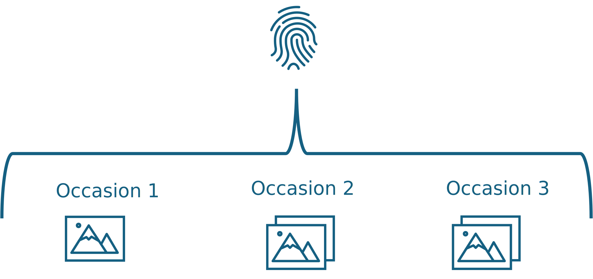

# Animal- / Pattern-recognition simplified

The purpose of mark-recapture photo identification methods is to take a large photographic record of unknown individuals 
and, using unique identifiers and markings, piece together which of those individuals were observed on multiple occasions.
In the course of our photography and in-person observations we may need to ascribe nicknames to these erstwhile unknown 
individuals. Naming animals is fun and useful for keeping records in line! Over time, they may even become familiar to us
but the photographic record is naive to our experience.

I mention this only to clarify that photo mark-recapture methods match _patterns_, rather than individuals. An individual 
may have been photographed on five separate occasions. Depending on the study system, that individual may have been given a 
different nickname on each of those occasions. Maybe, on each occasion, that individual was photographed three times. This
gives us 15 photographic examples, from 5 occasions, with 5 different nicknames, all of a single individual.

The language around identifying individuals in a photographic record can get confusing very quickly if we lose track of 
the hierarchy of how we collect data. An individual _contains_ several within-occasion names and maybe dozens of photographic
examples. Their unique pattern, present in each photo, is the thread by which we link up all of these photographic examples. 

 

  
  <figcaption>Fig. 1: An individual exists in the photographic record as a collection of photos from several occasions, with
multiple nicknames across all capture events.</figcaption>

 

 

Generally, we don't know in advance whether an individual was captured multiple times. Instead we ask "have we seen this 
individual/pattern elsewhere in our photographic record?". Different individual-recognition packages approach this question
in different ways but, generally, their methods are roughly similar. For simplicity, we illustrate the general idea with 
colourful geometric shapes standing in for unique identifying patterns.

Something that may seem obvious, but can be overlooked is that photographic records are generally processed backwards; 
a pattern photographed on occasion two can be compared to patterns photographed on occasion one and patterns from occasion 
three can be compared against both occasions one and two. As we sample on more occasions, and the photographic record grows,
later photos are compared against an ever-increasing pool of potential matches.

 

  
  <figcaption>Fig. 2: Photographic records are generally assessed looking backwards in time. Individuals/patterns captured later are
compared against earlier occasions. Colourful polygons represent unique identifying patterns captured in each occasion.</figcaption>

 

 

First, we can take a photographic example (or many photographic examples) of an individual on a given occasion and compare 
that (or those) against all previous photos in our photographic record. 
Here, we take our blue triangle from occasion 3, and compare against our photographic record of of colourful polygons 
captured on occasion two.

 

<figure align="center">
  
  <figcaption>Fig. 3: A focal individual/pattern (left) might be compared against a photographic record full of distinct 
patterns (right).</figcaption>
</figure>

 

 

Some algorithm compares our focal pattern against all other patterns in the photographic record and determines how well 
they match. In this example, we can imagine that our chosen algorithm
compares patterns by colour, number of vertices, and the angle of those vertices. On shape alone, our two triangles in the 
photographic record match very closely to the focal pattern, but only one is the right colour!

 

<figure align="center">
  
  <figcaption>Fig. 4: An example of pairwise comparisons between the focal pattern/individual and potential matching 
patterns/individuals in the photographic record. Thicker lines denote a better match.</figcaption>
</figure>

 

 

Depending on the sophistication or bravery of the software used, the system will then either automatically assign positive
matches for the focal pattern in the photographic record (A), or sort the possible matches and present the best N matches for
the users consideration (B). 

 

<figure align="center">
  
  <figcaption>Fig. 5: Two outcomes of individual recognition systems - A) the system determines positive matches or the absence of 
a suitable match automatically; B) the system sorts potential matches for the user to confirm or reject.</figcaption>
</figure>

 

 

Sorting patterns based on similarity is relatively straight-forward. However, automatic matching requires some 
fine-tuning of thresholds to determine a positive match from just a very similar pattern. The green triangles above are 
very similar to our focal pattern. So a suitable algorithm would need to reject a perfectly-matching silhouette that happens
to have the wrong line colour. As patterns get more complex, and the quality of patterns (blurry photos, images at oblique 
angles, variation in zoom, loss of colour fidelity due to ambient lighting) it becomes harder to get this right.

Our approach favours the sorting method, to leave final decision-making on matching patterns to the user.
