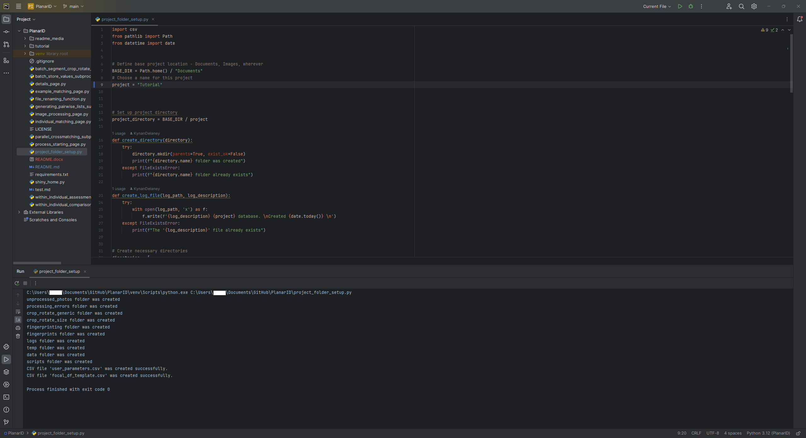
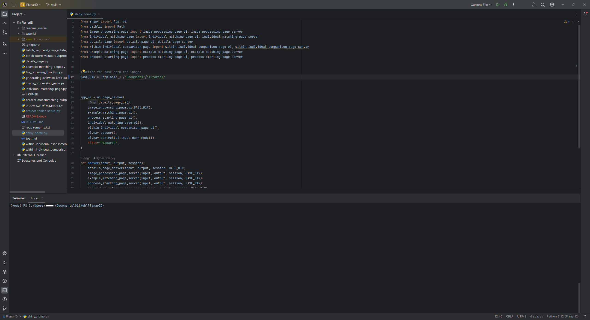
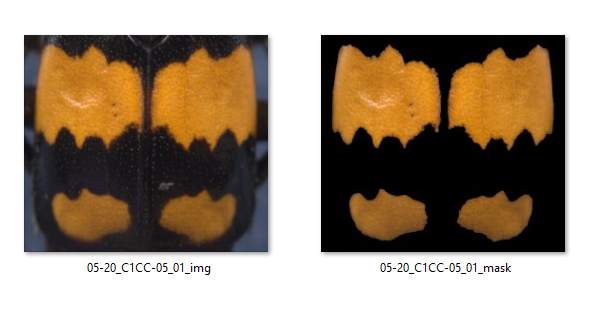
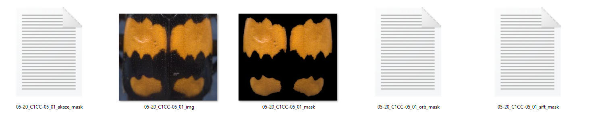
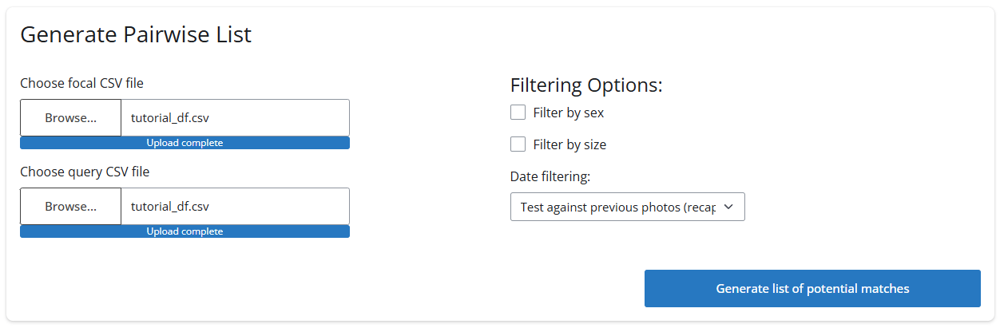
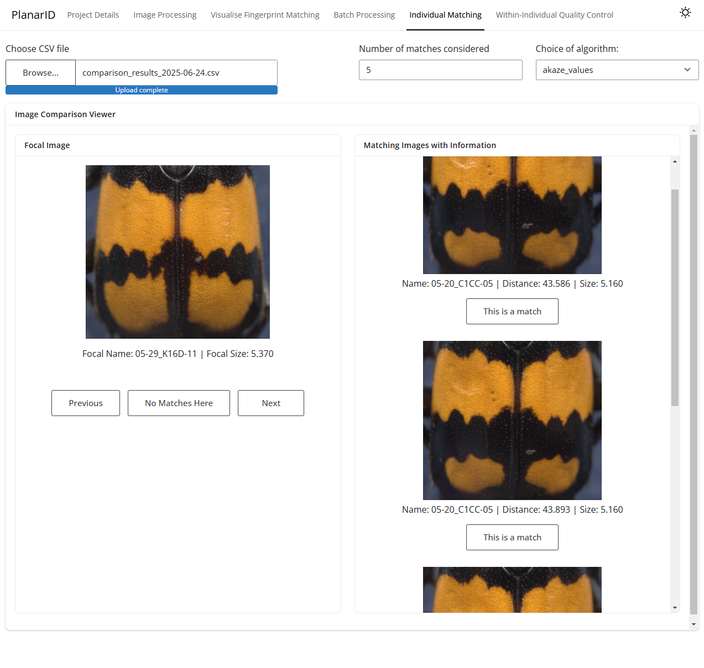

# Tutorial - Burying beetles

For a practical guide on how to analyse a photographic record, we have included a selection of images of our study species
the burying beetle, *Nicrophorus vespilloides*. The tutorial photographic record contains 22 photos of three individuals (Figure 1), 
imaged on ten different dates. These photos have been appropriately named with the ```[date]_[within-week name]_[example]``` 
format. The`.csv` (`tutorial_df`) contains information about individual sex, within-week names, date of "capture" and
body size. These data have been provided to mimic realistic capture data - size and sex data

Together, this is everything we need to get started identifying individuals in a photographic record.


Tutorial contents:

- tutorial images folder: 22 images of 3 individuals taken across 10 sampling Occasions. 
- tutorial_df: A `.csv` of "capture data" that includes within-week names, date of capture, individual sex, and body size (Table 1).

<br>

<table>
  <tr>
    <td align="center"><br><sub>C1CC-05</sub></td>
    <td align="center"><br><sub>K16D-11</sub></td>
    <td align="center"><br><sub>C9B-11</sub></td>
  </tr>
</table>
<p align="center"><em>Figure 1: Three unique individuals in our tutorial photographic record.</em></p>


<br>

<p align="left"><em>Table 1: A snapshot of the tutorial dataset. </em></p>

| focal         | datef |  sex  |  size  |
|:--------------|:-----:|:-----:|:------:|
| 05-20_C1CC-05 | 5.20  |   M   |  5.16  |
| 05-29_K16D-11 | 5.29  |   F   |  5.37  |
| 06-02_C9B-11  | 6.02  |   M   |  4.02  |
| 06-08_C1CC-05 | 6.08  |   M   |  5.16  |
| 06-13_K16D-11 | 6.13  |   F   |  5.37  |

<br>

 
## Creating a project folder

We will assume that at this point, the user has installed an interactive development environment (IDE), Python 3.XX, has
cloned the repository from github, and installed the package requirements listed in `requirements.txt` (details in the 
repository `readme.md`). Therefore, for this tutorial, our first task is to create a project directory.

In the IDE (we have chosen Pycharm Community Edition for this example), double click on the `project_folder_setup` script 
on the left tab. In the script editor, name the project `Tutorial` in the highlighted line (line 9; Figure 2). Now we run
the script:

1. In the terminal in the IDE, run the following command:

```bash
python project_folder_setup.py
```

OR

2. Click the run script button in the top right of the Pycharm IDE

<br>

If all goes well, the console will print all of the files and folders that have been created and the new `Tutorial` 
directory can be explored.

<p align="center" >
  
  <figcaption align="center">Figure 2: Setting the desired project name for a new directory.</figcaption>
</p>

<br>

## Add the photographic record to the directory

Once the project directory has been made, we can copy and paste our tutorial images into the `unprocessed_photos` folder 
in the `Tutorial` directory.

## Point the shiny app at the current directory

We need the shiny app and project directory to be looking in the same place for images; we set this manually in the `shiny_home.py`
script.

In the IDE, we double click on the `shiny_home.py` script on the left tab. In the script editor, we set the base directory to
`Tutorial` in the highlighted line (line 12; Figure 2). 

<p align="center" >
  
  <figcaption align="center">Figure 2: Connecting the shiny app with the tutorial directory.</figcaption>
</p>

<br>


Now we launch the app; in the terminal in the IDE, run the following command:

```bash
shiny run planar-id.py
```

<br>

## Set image thresholds to extract identifying patterns

In the app, we go to the `Image Processing` tab. We can click `browse` in the UI and navigate to the `unprocessed_photos` 
folder and select any image to be rendered in the app. We can then start setting threshold values to extract patterns and
fingerprints.

Good starting values for annotating the elytral pattern in these beetles are outlined in Table 2.

<br>

<p align="left"><em>Table 2: Colour thresholds for the tutorial photographic record. </em></p>

|             |  Lower  |  Upper  |
|:------------|:-------:|:-------:|
| Hue         |   11    |   40    |
| Saturation  |   75    |   240   |
| Value       |   80    |   240   |

<br>

At this point, other image threshold values are optional, but their consequences on pattern annotation, human- and 
algorithm-readable output, and *fingerprint* extraction can be explored in this tab.

Whatever other values are chosen, we can save these thresholds by clicking the `Save parameters` button at the bottom of 
the sidebar.

<br>

## Annotate patterns using set thresholds

In the app, we can navigate to the `Batch Processing` tab. In the first section, `Crop and Rotate`, we can click `Start image
cropping and rotating`. On Windows, a console window will appear that prints the status of image processing. On Linux, 
these statements will be printed in the IDE console.

This should take less than ten seconds. We can check the output of this step in the `fingerprints` folder in the
`Tutorial` project directory. For each input photo we should see a collection of images cropped to the identifying 
pattern we care about (Figure 3). 

<p align="center" >
  
  <figcaption align="center">Figure 3: A cropped version of an original image for individual C1CC-05, and a "machine-readable"
mask of the identifying pattern.</figcaption>
</p>

<br>

## Extract *fingerprints* using set thresholds

***We must first refresh the app*** and navigate back to the `Batch Processing` tab. In the second section `Extract fingerprints`,
we can make sure all algorithm boxes are checked and click `Start fingerprint extraction`. On Windows, a console window 
will appear that prints the status of image processing. On Linux, these statements will be printed in the IDE console. 

This should take less than 30 seconds. We can check the output of this step in the `fingerprints` folder in the 
`Tutorial` project directory. _Fingerprints_ for each algorithm we specified are saved as `.txt` files.

<p align="center" >
  
  <figcaption align="center">Figure 4: Labelled fingerprint .txt files are added to each pair of processed photos.</figcaption>
</p>

<br>


## Generate a pairwise list for *fingerprint* comparison

***We must first refresh the app*** and navigate back to the `Batch Processing` tab. In the third section `Generate pairwise list`,
we can uncheck all filtering options and set `Date filtering` to "Test against previous photos (recaptures)". In the 
`focal` and `query` `.csv` fields, choose the `tutorial_df.csv` file included in this tutorial. We can then click 
`Generate list of potential matches` (Figure 5). 

<p align="center" >
  
  <figcaption align="center">Figure 4: Labelled fingerprint .txt files are added to each pair of processed photos.</figcaption>
</p>

<br>

In this tutorial, this should generate a 219-row `.csv`called`pairwise_comparison_list_YYYY-MM-DD` in the `Tutorial` 
directory `/data` folder. This should take less than 20 seconds. 

If we explore this `.csv`, we see that individual`05-20_C1CC-05`, captured in May, has no previous Occasions to be 
compared against (Table 3). We can also note that every image from the second sampling Occasion(i.e., two images of 
`05-29_K16D-11`) is compared against every image in the first sampling Occasion. 

Finally, we can note that, if we had included size and sex filtering, we may not have compared these particular images at all!

<br>

<p align="left"><em>Table 3: A snapshot of the pairwise list generated from the tutorial photographic record and dataset.</em></p>

| focal_image       | test_image        | focal_name     | test_name      |    focal_size    |  focal_sex   |  test_size   | test_sex  |
|:------------------|:------------------|:---------------|:---------------|:----------------:|:------------:|:------------:|:---------:|
| 05-20_C1CC-05_01  | 	No matching      | 	05-20_C1CC-05 | 	No matching   |      	5.16       |      	M      |             |    	     |	
| 05-20_C1CC-05_02  | 	No matching      | 	05-20_C1CC-05 | 	No matching   |      	5.16       |      	M      |     		      |          |
| 05-29_K16D-11_01  | 	05-20_C1CC-05_01 | 	05-29_K16D-11 | 	05-20_C1CC-05 |      	5.37       |      	F      |    	5.16     |    	M     |
| 05-29_K16D-11_01  | 	05-20_C1CC-05_02 | 	05-29_K16D-11 | 	05-20_C1CC-05 |      	5.37       |      	F      |    	5.16     |    	M     |
| 05-29_K16D-11_02  | 	05-20_C1CC-05_01 | 	05-29_K16D-11 | 	05-20_C1CC-05 |      	5.37       |      	F      |    	5.16     |    	M     |
| 05-29_K16D-11_02	 | 05-20_C1CC-05_02  | 	05-29_K16D-11 | 	05-20_C1CC-05 |      	5.37       |      	F      |    	5.16     |    	M     | 

<br>

## Run pairwise comparisons to detect matching patterns in the photographic record

***We must first refresh the app*** and navigate back to the `Batch Processing` tab. In the fourth section, 
`Run Pairwise Comparisons`, we can browse for the `pairwise_comparison_list_YYYY-MM-DD` in the `/data` folder of the
`Tutorial` directory. We can then we can make sure all the algorithm boxes are checked and click `Start fingerprint comparisons`.

In this tutorial, this should generate a 219-row `.csv`called `comparison_results_YYYY-MM-DD` in the `Tutorial` 
directory `/data` folder. This should take less than 20 seconds. 


## Manually compare matches

Finally, to view and confirm matching patterns in photos, we can navigate to the `Individual Matching` tab. Here, we can
select the `comparison_results_YYYY-MM-DD.csv` file we just generated and compare pairs of photos based on similarity according 
to the algorithms we implemented, body size, and sex (Figure 5). Our focal individuals are presented in the left panel, and their most 
similar counterparts in the photographic record are presented in the right hand panel. `Number of matches considered` 
limits the number of images displayed in the right hand panel.


<p align="center" >
  
  <figcaption align="center">Figure 5: A visual dashboard for accepting or rejecting pattern-based matches in the 
photographic record.</figcaption>
</p>

<br>

The output of clicking `No matches here` or `This is a match` is a file called `matches_YYYY-MM-DD.csv` which is a growing 
compendium of individuals' aliases in the photographic record. This list of aliases can be converted to a census history
of individuals in R or Python (future convenience functions will be detailed in the repository `.readme`)