# Tutorial - Burying beetles

For a practical guide on how to analyse a photographic record, we have included a selection of images of our study species
the burying beetle, *Nicrophorus vespilloides*. The tutorial photographic record contains 22 photos of three individuals (Figure 1), 
imaged on ten different dates. These photos have been appropriately named with the ```[date]_[within-week name]_[example]``` 
format. The `.csv` (`tutorial_df`) contains information about individual sex, within-week names, date of "capture" and
body size. These data have been provided to mimic realistic capture data - size and sex data

Together, this is everything we need to get started identifying individuals in a photographic record.


Tutorial contents:

- tutorial images folder: 22 images of 3 individuals taken across 10 sampling Occasions. 
- tutorial_df: A `.csv` of "capture data" that includes within-week names, date of capture, individual sex, and body size (Table 1).
- Brief examples of other patterns to segment and process (below).
<br>

<table>
  <tr>
    <td align="center"><br><sub>C1CC-05</sub></td>
    <td align="center"><br><sub>K16D-11</sub></td>
    <td align="center"><br><sub>C9B-11</sub></td>
  </tr>
</table>
<p align="center"><em>Figure 1: Three unique individuals in our tutorial photographic record.</em></p>


<br>

<p align="left"><em>Table 1: A snapshot of the tutorial dataset. </em></p>

| focal         | datef |  sex  |  size  |
|:--------------|:-----:|:-----:|:------:|
| 05-20_C1CC-05 | 5.20  |   M   |  5.16  |
| 05-29_K16D-11 | 5.29  |   F   |  5.37  |
| 06-02_C9B-11  | 6.02  |   M   |  4.02  |
| 06-08_C1CC-05 | 6.08  |   M   |  5.16  |
| 06-13_K16D-11 | 6.13  |   F   |  5.37  |

<br>

 
## Creating a project folder

We will assume that at this point, the user has installed an interactive development environment (IDE), Python 3.XX, has
cloned the repository from github, and installed the package requirements listed in `requirements.txt` (details in the 
repository `readme.md`). Therefore, for this tutorial, our first task is to create a project directory.

In the IDE (we have chosen Pycharm Community Edition for this example), double click on the `project_folder_setup` script 
on the left tab. In the script editor, name the project `Tutorial` in the highlighted line (line 7; Figure 2). Now we run
the script:

1. In the terminal in the IDE, run the following command:

```bash
python project_folder_setup.py
```

OR

2. Click the run script button in the top right of the Pycharm IDE

<br>

If all goes well, the console will print all of the files and folders that have been created and the new `Tutorial` 
directory can be explored.

<p align="center" >
  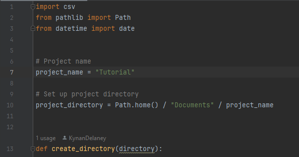
  <figcaption align="center">Figure 2: Setting the desired project name for a new directory.</figcaption>
</p>

<br>

## Add the example data to the project directory

Once the project directory has been made, we can copy and paste our tutorial images into the `unprocessed_photos` folder 
in the `Tutorial` directory. We also need to drop the `tutorial_df.csv` into the `data` folder in the `Tutorial` directory.

## Point the shiny app at the current directory

We need the shiny app and project directory to be looking in the same place for images; we set this manually in the `shiny_home.py`
script.

In the IDE, we double click on the `planar-id.py` script on the left tab. In the script editor, we set the base directory to
`Tutorial` in the highlighted line (line 12; Figure 2). 

<p align="center" >
  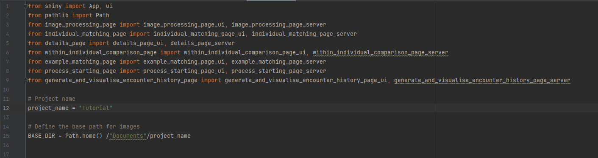
  <figcaption align="center">Figure 2: Connecting the shiny app with the tutorial directory.</figcaption>
</p>

<br>


Now we launch the app; in the terminal in the IDE, run the following command:

```bash
shiny run planar-id.py
```

The following code will be printed in the terminal - if the app doesn't open automatically, click on the `http link` provided, 
or copy it into your web browser to view and interact with the app:

```bash
INFO:     Started server process [XXXXX]
INFO:     Waiting for application startup.
INFO:     Application startup complete.
INFO:     Uvicorn running on http://127.0.0.1:8000 (Press CTRL+C to quit)
```
<br>

## Set image thresholds to extract identifying patterns

In the app, we go to the `Image Processing` tab. We can click `browse` in the UI and navigate to the `unprocessed_photos` 
folder and select any image to be rendered in the app. We can then start setting threshold values to extract patterns and
fingerprints.

Good starting values for annotating the elytral pattern in these beetles are outlined in Table 2.

<br>

<p align="left"><em>Table 2: Colour thresholds for the tutorial photographic record. </em></p>

|             | Lower | Upper |
|:------------|:-----:|:-----:|
| Hue         |  11   |  30   |
| Saturation  |  75   |  240  |
| Value       |  85   |  240  |

<br>

At this point, other image threshold values are optional, but their consequences on pattern annotation, human- and 
algorithm-readable output, and *fingerprint* extraction can be explored in this tab.

Whatever other values are chosen, we can save these thresholds by clicking the `Save parameters` button at the bottom of 
the sidebar.

<br>

## Annotate patterns using set thresholds

In the app, we can navigate to the `Batch Processing` tab. In the first section, `Crop and Rotate`, we can click `Start image
cropping and rotating`. On Windows, a console window will appear that prints the status of image processing. On Linux, 
these statements will be printed in the IDE console.

This should take less than ten seconds. We can check the output of this step in the `fingerprints` folder in the
`Tutorial` project directory. For each input photo we should see a collection of images cropped to the identifying 
pattern we care about (Figure 3). 

<p align="center" >
  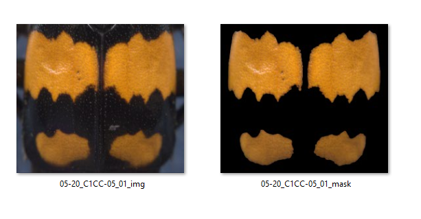
  <figcaption align="center">Figure 3: A cropped version of an original image for individual C1CC-05, and a "machine-readable"
mask of the identifying pattern.</figcaption>
</p>

<br>

## Extract *fingerprints* using set thresholds

***We must first refresh the app*** and navigate back to the `Batch Processing` tab. In the second section `Extract fingerprints`,
we can make sure all algorithm boxes are checked and click `Start fingerprint extraction`. On Windows, a console window 
will appear that prints the status of image processing. On Linux, these statements will be printed in the IDE console. 

This should take less than 30 seconds. We can check the output of this step in the `fingerprints` folder in the 
`Tutorial` project directory. _Fingerprints_ for each algorithm we specified are saved as `.txt` files.

<p align="center" >
  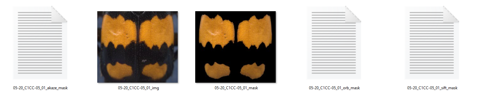
  <figcaption align="center">Figure 4: Labelled fingerprint .txt files are added to each pair of processed photos.</figcaption>
</p>

<br>


## Generate a pairwise list for *fingerprint* comparison

***We must first refresh the app*** and navigate back to the `Batch Processing` tab. In the third section `Generate pairwise list`,
we can uncheck all filtering options and set `Date filtering` to "Test against previous photos (recaptures)". In the 
`focal` and `query` `.csv` fields, choose the `tutorial_df.csv` file included in this tutorial. We can then click 
`Generate list of potential matches` (Figure 5). 

<p align="center" >
  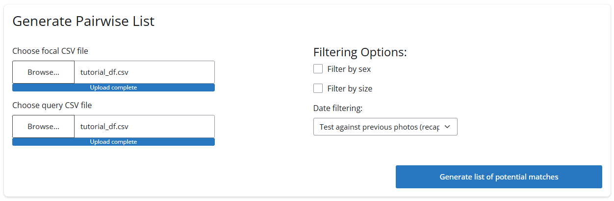
  <figcaption align="center">Figure 4: Labelled fingerprint .txt files are added to each pair of processed photos.</figcaption>
</p>

<br>

In this tutorial, this should generate a 219-row `.csv`called`pairwise_comparison_list_YYYY-MM-DD` in the `Tutorial` 
directory `/data` folder. This should take less than 20 seconds. 

If we explore this `.csv`, we see that individual`05-20_C1CC-05`, captured in May, has no previous Occasions to be 
compared against (Table 3). We can also note that every image from the second sampling Occasion(i.e., two images of 
`05-29_K16D-11`) is compared against every image in the first sampling Occasion. 

Finally, we can note that, if we had included size and sex filtering, we may not have compared these particular images at all!

<br>

<p align="left"><em>Table 3: A snapshot of the pairwise list generated from the tutorial photographic record and dataset.</em></p>

| focal_image       | test_image        | focal_name     | test_name      |    focal_size    |  focal_sex   |  test_size   | test_sex  |
|:------------------|:------------------|:---------------|:---------------|:----------------:|:------------:|:------------:|:---------:|
| 05-20_C1CC-05_01  | 	No matching      | 	05-20_C1CC-05 | 	No matching   |      	5.16       |      	M      |             |    	     |	
| 05-20_C1CC-05_02  | 	No matching      | 	05-20_C1CC-05 | 	No matching   |      	5.16       |      	M      |     		      |          |
| 05-29_K16D-11_01  | 	05-20_C1CC-05_01 | 	05-29_K16D-11 | 	05-20_C1CC-05 |      	5.37       |      	F      |    	5.16     |    	M     |
| 05-29_K16D-11_01  | 	05-20_C1CC-05_02 | 	05-29_K16D-11 | 	05-20_C1CC-05 |      	5.37       |      	F      |    	5.16     |    	M     |
| 05-29_K16D-11_02  | 	05-20_C1CC-05_01 | 	05-29_K16D-11 | 	05-20_C1CC-05 |      	5.37       |      	F      |    	5.16     |    	M     |
| 05-29_K16D-11_02	 | 05-20_C1CC-05_02  | 	05-29_K16D-11 | 	05-20_C1CC-05 |      	5.37       |      	F      |    	5.16     |    	M     | 

<br>

## Run pairwise comparisons to detect matching patterns in the photographic record

***We must first refresh the app*** and navigate back to the `Batch Processing` tab. In the fourth section, 
`Run Pairwise Comparisons`, we can browse for the `pairwise_comparison_list_YYYY-MM-DD` in the `/data` folder of the
`Tutorial` directory. We can then we can make sure all the algorithm boxes are checked and click `Start fingerprint comparisons`.

In this tutorial, this should generate a 219-row `.csv`called `comparison_results_YYYY-MM-DD` in the `Tutorial` 
directory `/data` folder. This should take less than 20 seconds. 


## Manually compare matches

Finally, to view and confirm matching patterns in photos, we can navigate to the `Individual Matching` tab. Here, we can
select the `comparison_results_YYYY-MM-DD.csv` file we just generated and compare pairs of photos based on similarity according 
to the algorithms we implemented, body size, and sex (Figure 5). Our focal individuals are presented in the left panel, and their most 
similar counterparts in the photographic record are presented in the right hand panel. `Number of matches considered` 
limits the number of images displayed in the right hand panel.


<p align="center" >
  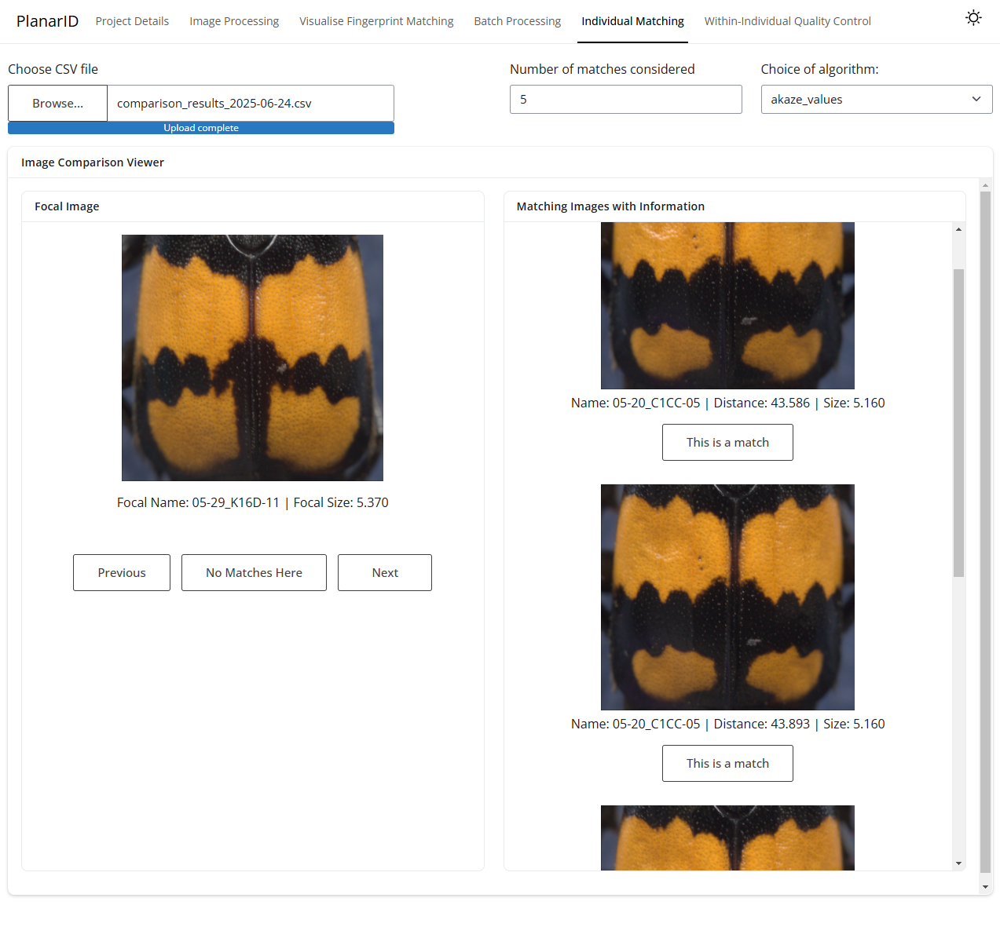
  <figcaption align="center">Figure 5: A visual dashboard for accepting or rejecting pattern-based matches in the 
photographic record.</figcaption>
</p>

<br>

The output of clicking `No matches here` or `This is a match` is a file called `matches_YYYY-MM-DD.csv` which is a growing 
compendium of individuals' aliases in the photographic record. 

## Export encounter history

The list of aliases can be converted to a census history directly within PlanarID by passing the `matches_YYYY-MM-DD.csv`
to the  to the **Generate and Visualise Encounter History** (Figure 6) tool and hitting `Save encounters`. The resulting
`encounter_history_YYYY-MM-DD.csv` returns a census-style recapture history.
This page also returns summary tables on how many times each individual was present in the photographic record, the 
distribution of frequencies of re-occurrence in the record, as well as a basic network graph detailing how each photographs 
of each individual were linked over time.

The `matches_YYYY-MM-DD.csv` can also be easily processed in R or Python.

<p align="center" >
  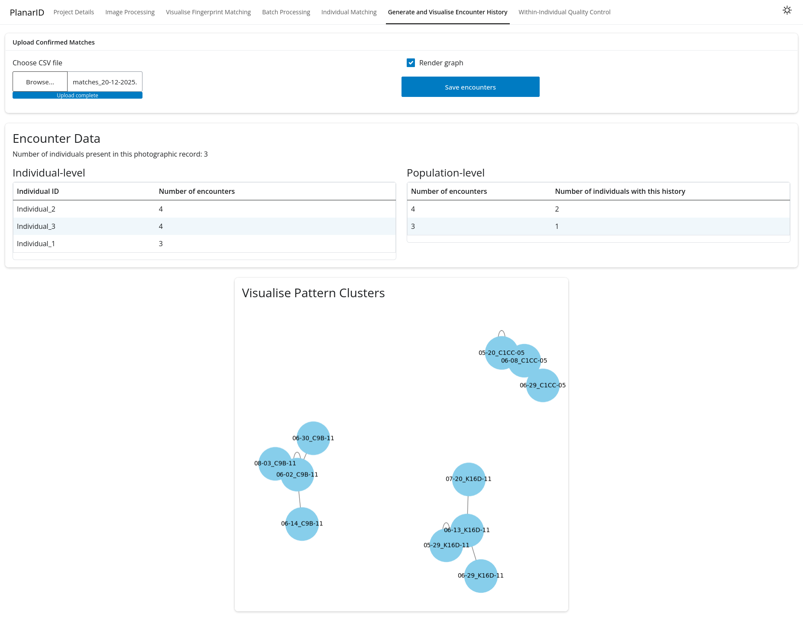
  <figcaption align="center">Figure 6: A final convenience tool to convert manually-determined matches to an interpretable census history.</figcaption>
</p>

This page assigns incremental names to individuals as they appear and are identified in the photographic record. The naming
scheme is simply `Individual_[N]`. The `.csv` output lists every occasion on which an individual was present, with their
alias in that sampling occasion included (Table 4).

<br>

<p align="left"><em>Table 4: A neatly formatted census-style recapture history that can be passed to mark-recapture analysis packages in R.</em></p>

| individual   | alias| encounter_occasion|
|:-------------|:-----|:-----|
| Individual_1 |06-08_C1CC-05|06_08|
| Individual_2 |06-13_K16D-11|06_13|
| Individual_3 |06-14_C9B-11|06-14|
| Individual_1 |06-29_C1CC-05|06-29|
| Individual_2 |06-29_K15D-11|06-29|
| ...          |...|...|
| Individual_1 |05-20_C1CC-05|05-20|

<br>

## Closing the app

To close the app, click on the terminal in the IDE and hit CTRL+C to quit.


# Example image segmentation and fingerprinting

Different systems and patterns require different parameter values to segment for fingerprinting. Below, I include some 
example parameter values for different kinds of backgrounds/patterns that we may want to process.

## Black and green butterflies

A butterfly with black and green wings wings, against a light, beige background of sand. Image sourced from 
[here](https://www.pickpik.com/green-malachite-butterfly-green-niagara-butterfly-conservatory-exotic-insect-wildlife-black-67926).
Setting colour thresholds to separate green patches from a beige background might be difficult. Instead, we can focus on
the black parts of the body and wings to segment the entire butterfly from the background (Fig. 6). We capture dark regions
by setting `value` between 0 and 150. `threshold_value` is a separate parameter that also needs to be lowered to accept 
segmenting on dark areas. Here, the wings and body form one contiguous region of dark pattern, so we can set `num_patches` 
to one. When it comes to generating *fingerprints*, we will only be describing features along the wings and body, removing 
any background noise.

<div style="display: flex; align-items: center; justify-content: center; gap: 20px;">

  <!-- Table -->
  <div style="flex: 1; max-width: 200px; display: flex; justify-content: center;">
    <table>
      <tr><th>Parameter</th><th>Value</th></tr>
      <tr><td>hue_low</td><td>0</td></tr>
      <tr><td>saturation_low</td><td>0</td></tr>
      <tr><td>value_low</td><td>0</td></tr>
      <tr><td>hue_high</td><td>179</td></tr>
      <tr><td>saturation_high</td><td>255</td></tr>
      <tr><td>value_high</td><td>150</td></tr>
      <tr><td>kernel_size</td><td>7</td></tr>
      <tr><td><strong>threshold_value</strong></td><td><strong>0</strong></td></tr>
      <tr><td>num_patches</td><td>1</td></tr>
    </table>
  </div>

  <!-- Images with labels -->
  <div style="flex: 1; display: flex; flex-direction: column; align-items: center;">
    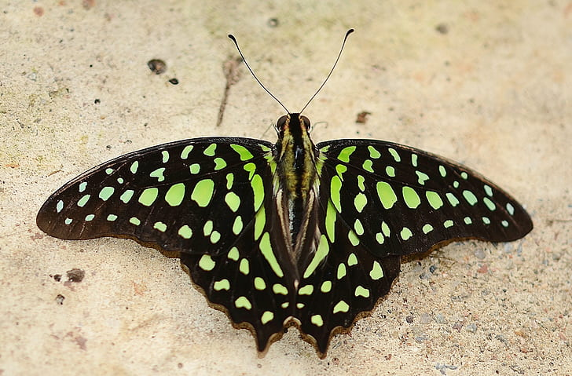
    <span style="margin-top: 5px; font-weight: bold;">Original Image</span>
  </div>

  <div style="flex: 1; display: flex; flex-direction: column; align-items: center;">
    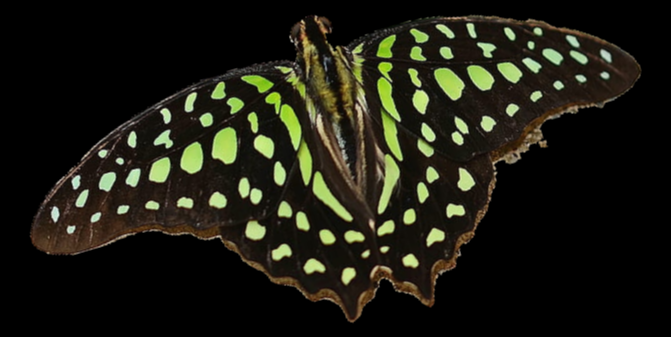
    <span style="margin-top: 5px; font-weight: bold;">Segmented image/pattern</span>
  </div>

  <div style="flex: 1; display: flex; flex-direction: column; align-items: center;">
    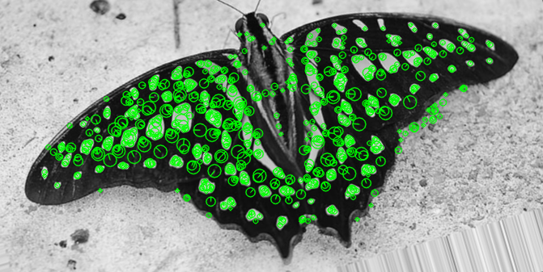
    <span style="margin-top: 5px; font-weight: bold;">Feature Points restricted to wing pattern</span>
  </div>

</div>
<p align="center"><em>Figure 6: The key parameter values and stages of fingerprinting wing patches in a butterfly with dark wings 
and light patches that are similar to background colours.</em></p>

<br>

## Red, black, and white butterflies
A butterfly with white and red markings on black wings, against a neutral woody-brown background. Image sourced from
[here](https://en.wikipedia.org/wiki/Vanessa_atalanta#/media/File:Red_admiral_(Vanessa_atalanta)_Hungary.jpg).
Extracting a bold colour like red is relatively straightforward using HSV values (listed below; Fig. 7). There are 4 distinct
regions of red patches, anterior-posterior along each wing, and laterally across the back of each wing, so we set `num_patches`
to four. We might expect good performance of fingerprinting the red regions to discriminate between individuals.

Our major issue here is that we must focus on one focal colour - choosing red means we ignore white patches that might be
of value for identification. White regions can be extracted separately, but this may be difficult against a light background. 
Further, some light patches are diffuse, and other are tinged blue, making precise colour thresholding labour intensive.

<div style="display: flex; align-items: center; justify-content: center; gap: 20px;">

  <!-- Table -->
  <div style="flex: 1; max-width: 200px; display: flex; justify-content: center;">
    <table>
      <tr><th>Parameter</th><th>Value</th></tr>
      <tr><td>hue_low</td><td>0</td></tr>
      <tr><td>saturation_low</td><td>0</td></tr>
      <tr><td>value_low</td><td>90</td></tr>
      <tr><td>hue_high</td><td>10</td></tr>
      <tr><td>saturation_high</td><td>255</td></tr>
      <tr><td>value_high</td><td>240</td></tr>
      <tr><td>kernel_size</td><td>7</td></tr>
      <tr><td>threshold_value</td><td>10</td></tr>
      <tr><td>num_patches</td><td>4</td></tr>
    </table>
  </div>

  <!-- Images with labels -->
  <div style="flex: 1; display: flex; flex-direction: column; align-items: center;">
    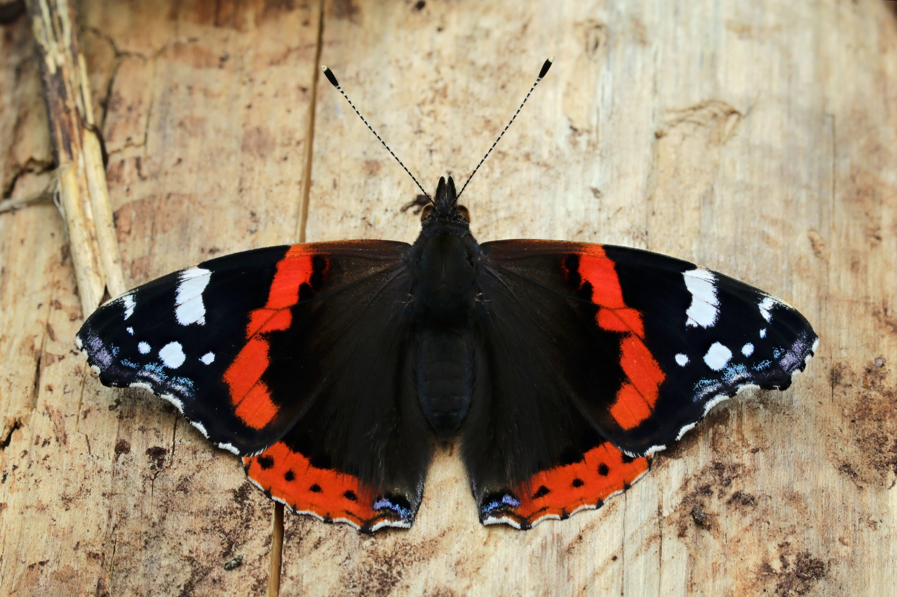
    <span style="margin-top: 5px; font-weight: bold;">Original Image</span>
  </div>

  <div style="flex: 1; display: flex; flex-direction: column; align-items: center;">
    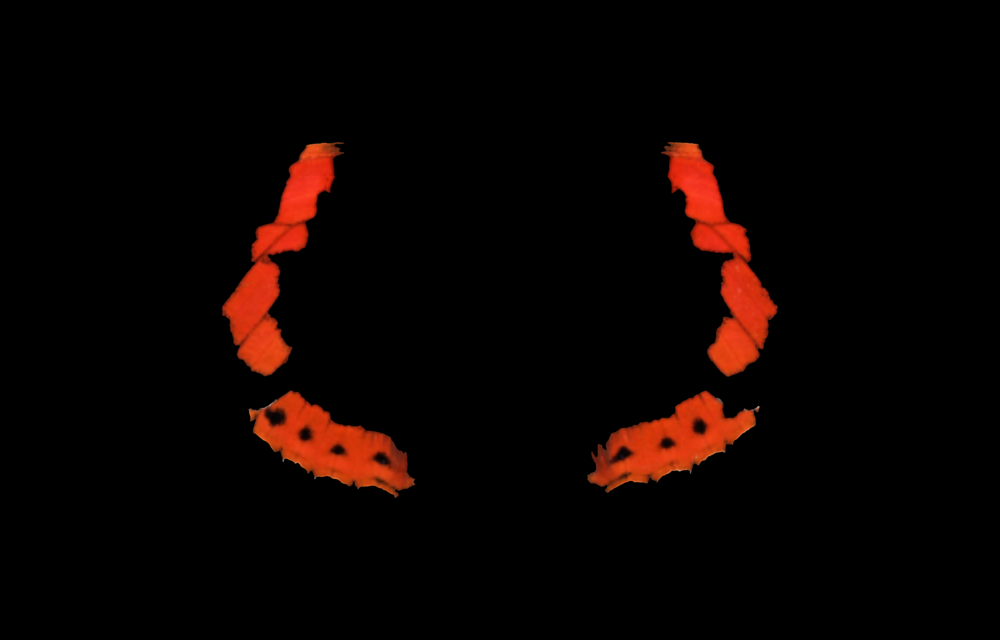
    <span style="margin-top: 5px; font-weight: bold;">Segmented red pattern</span>
  </div>

  <div style="flex: 1; display: flex; flex-direction: column; align-items: center;">
    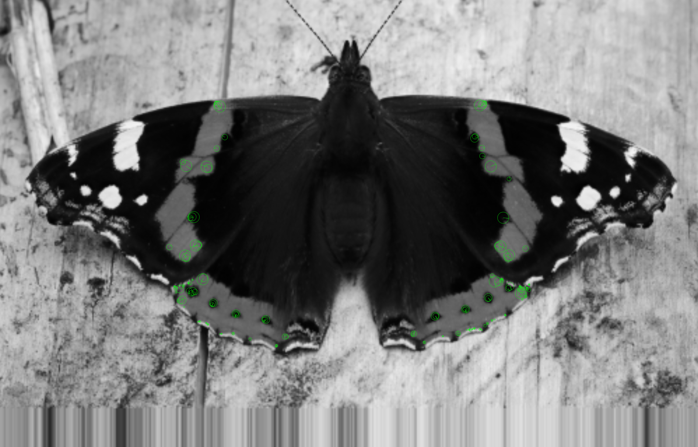
    <span style="margin-top: 5px; font-weight: bold;">Feature Points restricted to red patches</span>
  </div>

</div>
<p align="center"><em>Figure 7: The key parameter values and stages of fingerprinting wing patterns in a butterfly with 
bold red patches against distinct background colours.</em></p>

<br>

## Burying beetles
A burying beetle with discrete orange colour patches on a black body, against a blue background. Image sourced from our
testing population. Segmenting orange patterns from blue and black is almost trivial (Parameters outlined in Fig. 8).
`threshold_value` is returned to the default greyscale value of 50. We expect 4 discrete patches in this species, so
`num_patches` is set to four. `kernel_size` is left at default, but higher values will smooth out jagged edges of extract
colour patches.

<div style="display: flex; align-items: center; justify-content: center; gap: 20px;">

  <!-- Table -->
  <div style="flex: 1; max-width: 200px; display: flex; justify-content: center;">
    <table>
      <tr><th>Parameter</th><th>Value</th></tr>
      <tr><td>hue_low</td><td>0</td></tr>
      <tr><td>saturation_low</td><td>75</td></tr>
      <tr><td>value_low</td><td>85</td></tr>
      <tr><td>hue_high</td><td>25</td></tr>
      <tr><td>saturation_high</td><td>240</td></tr>
      <tr><td>value_high</td><td>240</td></tr>
      <tr><td>kernel_size</td><td>7</td></tr>
      <tr><td>threshold_value</td><td>50</td></tr>
      <tr><td>num_patches</td><td>4</td></tr>
    </table>
  </div>

  <!-- Images with labels -->
  <div style="flex: 1; display: flex; flex-direction: column; align-items: center;">
    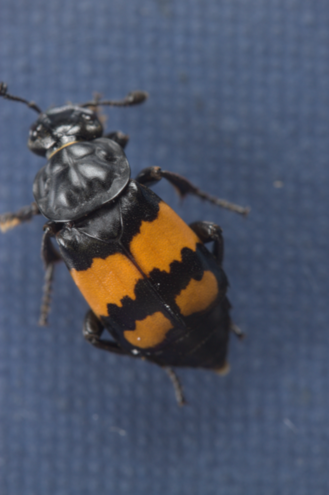
    <span style="margin-top: 5px; font-weight: bold;">Original Image</span>
  </div>

  <div style="flex: 1; display: flex; flex-direction: column; align-items: center;">
    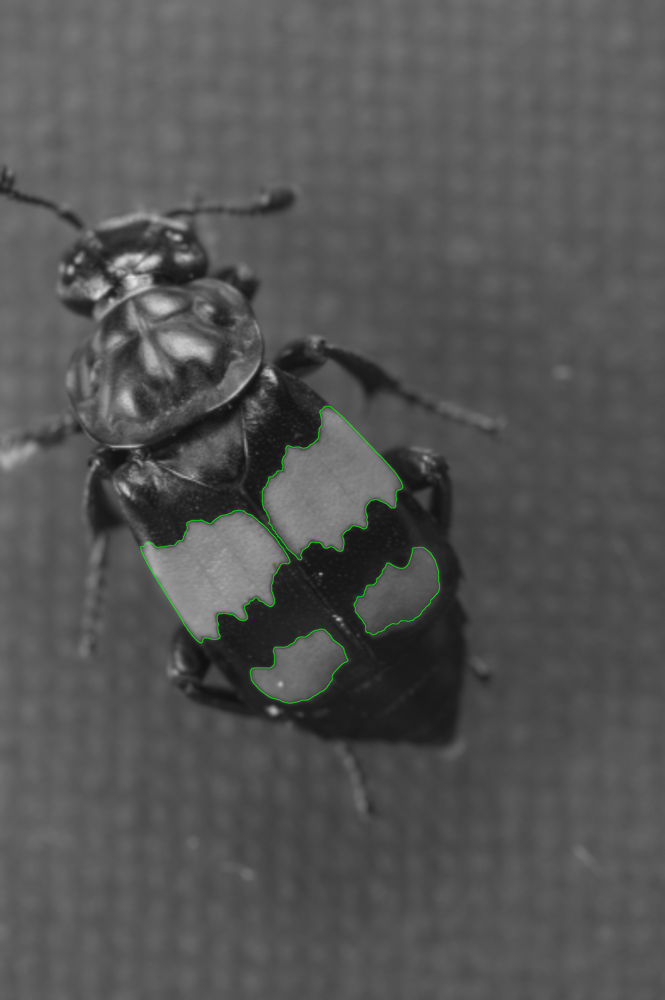
    <span style="margin-top: 5px; font-weight: bold;">Annotated orange pattern</span>
  </div>

  <div style="flex: 1; display: flex; flex-direction: column; align-items: center;">
    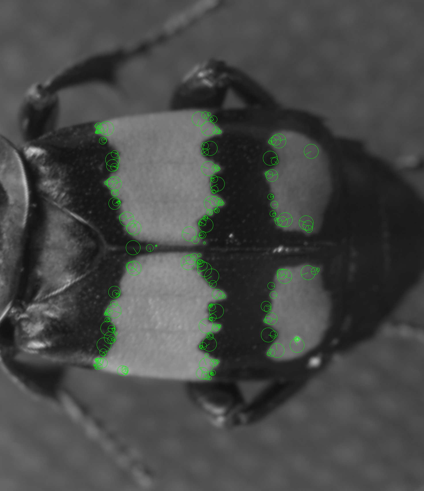
    <span style="margin-top: 5px; font-weight: bold;">Feature Points restricted to orange patches</span>
  </div>

</div>
<p align="center"><em>Figure 8: The key parameter values and stages of fingerprinting elytral patterns in a burying beetle
- bold orange patches against distinct body and background colours.</em></p>

<br>
